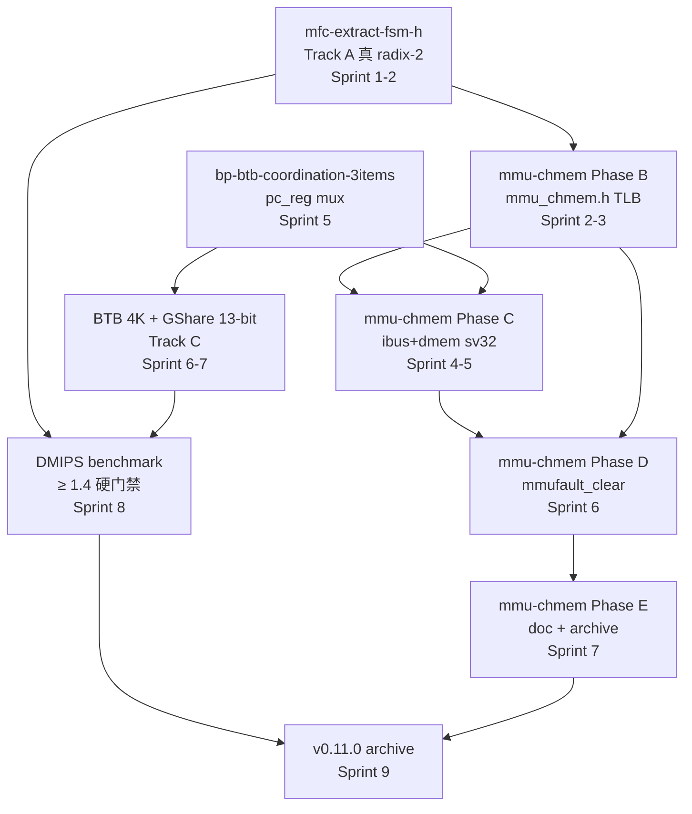

# Objective: objective-v0110-launch

## 1. 驱动诊断（Why now）

Wave 5 (v0.10.x-v0.11.0) 是 ISA 覆盖 + 分支预测收官窗口。当前债务:

1. **rv32um 0/8 FAIL** — `ip/cpu/arch/riscv/mul_div_fsm.h:475-500` `advance_fsm` 是 ad-hoc busy counter 非真 radix-2 iterative (AGENTS.md L36 记录, defer v0.11.0, 注释自证 "Phase A 仅满足部分 ad-hoc enum switch 是过渡实现")
2. **dhrystone livelock** — [cpu-integration][dhrystone] 60s+ timeout, CPU mul/div FSM 问题 (commit 76ac53f "确认 livelock")
3. **MMU CH_MEM owner 真空** — `cpu_factory_chmem.h:80-85` 自证 "Real sv32 CH_MEM owner TBD", mmu-chmem-pipeline-integration Phase A 已 commit (a3afcfa) 但 B-E 待实施
4. **DMIPS/MHz 0.0351 距硬门禁 1.4 差 40x** — 需真 radix-2 + fetch stall + BP 协同

## 2. 目标愿景 + 完成判据

v0.11.0 launch 全绿 (HANDOFF §10 退出标准 + AGENTS.md 已知测试状态):

| 判据 | 当前 | 目标 |
|------|------|------|
| [riscv-tests] | 40/48 (rv32um 0/8) | **48/48** |
| [mmu] | 59/59 (Phase A 后) | 维持 |
| [cpu-l1-mmu-demo] | 6/6 | **7/7** (workaround 移除) |
| [mmu-verilator] | 3/3 (plumbing only) | **5/5** (真 sv32) |
| [cpu-integration] | 85 PASS + 8 rv32um FAIL + dhrystone livelock | **全绿** |
| DMIPS/MHz | 0.0351 | **≥ 1.4** (硬门禁) |
| 4 architecture gates | 维护 | **0 error** |

## 3. 架构依据

- ADR-083: Plugin-style 单一 source of truth (业务 IP 双编译模式 TLM/CH_MEM)
- ADR-082: negotiate 集成 (mfc Phase G)
- ADR-046: 多周期 FSM 豁免 (MUL/DIV FSM 化, `CF_PLUGIN_USE_FSM_EXEMPT`)
- ADR-040 v2.0: CH_MEM 是新正道 (mmu-chmem Phase B-E)
- RISC-V Spec §4.3.1: satp CSR encoding (mmu-chmem Phase A D4-A/D5-TLM)

## 4. 反例 + 应用边界（Anti-patterns + Scope）

**非目标 (out-of-scope, v0.11.0 窗口不实施)**:
- 不在 v0.11.0 窗口做 Sv39/48 MMU 完整翻译 (D1 收窄)
- 不做多级 TLB / LRU-RRIP / ASID≠0 (D1 out-of-scope)
- 不引入 CSR plugin (CH_MEM 物理不可能, Oracle R11)

**应避免的反模式**:
- "DMIPS 差 40x 直接上 dual-issue 修复" — R1 砍分叉,先真 radix-2 + fetch stall + BP 协同三件套,无效再考虑 dual
- "跳过 Phase B 直接 Phase C" — Phase B 的 mmu_chmem.h TLB 是 Phase C 依赖,跳 B 直接 C 必失败
- "BTB miss fallback 永久 static" — 仅 phase-4 软门禁过渡,v1.0.0 必须 GShare 实装

## 5. 风险（Risks）

| 风险 ID | 描述 | 缓解 |
|---------|------|------|
| R-RADIX-1 | mfc-extract-fsm-h 1-2 周估时是 Oracle 经验值,实装时可能发现 ch_state_machine DSL 边界 case | 留 1 周 buffer 在 Sprint 1 后段,bp-btb 启动期 |
| R-RADIX-2 | mfc team 双 P1 (mfc-cpu-pipeline-multi-cycle-fsm 50/60 + mfc-extract-fsm-h 15) 资源冲突 | owner 区分:Phase H archive 归前者,真 radix-2 归后者,共享 `MulDivFsmPlugin::negotiate()` 接续 |
| R-CHMEM-1 | mmu-chmem Phase C ibus_chmem.h 需要 fetch stall framework,目前未到位 | Phase C 启动前先 sprint `bp-btb-coordination-3items` (0.5d, mfc Phase C 入口对齐) |
| R-BTB-1 | BTB CoreMark 提升 < 10% (R1 砍分叉) | bp_mode 锁 static,启动 Learn 通路 RCA (双 sprint) |
| R-EXEMPT | `CF_PLUGIN_USE_FSM_EXEMPT` + waiver > 20 处 (R5 CI 豁免爆发) | MUL/DIV FSM 用 ch_state_machine DSL 不计入豁免数,每 Phase 不超 5 处新增 |

## 6. 假设（Assumptions）

1. Phase A 已 commit (`a3afcfa`, 2026-10-08) — Bare + shadow 修复 → [mmu] 59/59 实测维持
2. mfc-cpu-pipeline-multi-cycle-fsm 50/60 由原 owner 推到 Phase H archive (60/60),不依赖本 objective 的 mfc-extract-fsm-h 推进
3. Phase B-E 实施不修改 `cpu_factory_chmem.h:80-85` 占位注释("Real sv32 CH_MEM owner TBD") — owner 由 mmu-chmem-pipeline-integration archive 时同步清理
4. `bash tools/run_chipforge_tests.sh --all` 在 Phase B-E 推进期每 sprint 末跑一次回归,与 Sprint 复盘一并记录到 §11 跟踪台账

## 7. 依赖图（Dependency Graph）

## 8. 时间盒（Timeline）

**总时长: 17 周 (2026-10-09 → 2027-01-24)**

| 阶段 | 起 | 止 | 周数 | Track | 交付 |
|------|----|----|------|-------|------|
| Sprint 1 (mfc-extract-fsm-h 启动) | 10-09 | 10-22 | 2.0 | A | rdd-builder P0-P3 + 真 radix-2 iterative advance_fsm 实装 + rv32um 8/8 中检 |
| Sprint 2-5 (mmu-chmem Phase B-C) | 10-23 | 11-30 | 5.5 | B | Phase B `mmu_chmem.h` 单级 ch_mem TLB + Phase C `ibus_chmem.h`/`dmem_chmem.h` sv32 消费 |
| Sprint 6-7 (mmu-chmem Phase D + BP 协议) | 12-01 | 12-22 | 3.0 | B+C | Phase D `mmu_exception_handler_chmem.h` + `bp-btb-coordination-3items` |
| Sprint 7-8 (BTB 4K + GShare + Phase E) | 12-23 | 01-13 | 3.0 | C+B | BTB 4K + GShare 13-bit PHT + Phase E doc + archive |
| Sprint 8 (DMIPS 验证 + 收官) | 01-14 | 01-24 | 1.5 | C+D | DMIPS ≥1.4 验证 + riscv-tests 48/48 + mmu-chmem archive |
| **复盘** | **01-24** | **01-31** | **1.0** | — | v0.11.0 archive 或 v0.11.x hotfix 决策 |

**关键检查点**:
- **11-30 DMIPS 中检**:radix-2 跑通后 DMIPS 是否从 0.0351 上升到 ≥0.5(若 < 0.3 触发 R-RADIX-2 资源回收,转 focus 写测试不抢 BP)
- **12-15 BTB 命中率初检**:BTB 4K 装好后 vs static baseline 命中率增量(若 < 5% 触发 R-BTB-1 砍分叉)
- **01-13 riscv-tests 48/48 中检**:是否全部 ELF PASS(若仍有 FAIL 触发 R-CHMEM-1 defer 到 v0.11.x)

## 9. 目标依赖与 Decision Gate

### 9.1 前置 objective 依赖
- `objective-mmu-chmem-phase-b-e` — mmu-chmem Phase B-E 完成 (CH_MEM MMU 集成)
- `mfc-cpu-pipeline-multi-cycle-fsm` Phase H archive (50/60 → 60/60)
- `mfc-extract-fsm-h` 真 radix-2 实装 (rv32um + dhrystone 修)

### 9.2 Go / No-Go Decision Gate
- **Go 条件** (全部满足):
  - [ ] [riscv-tests] 48/48
  - [ ] [mmu] 59/59 + [cpu-l1-mmu-demo] 7/7
  - [ ] [mmu-verilator] 5/5
  - [ ] DMIPS/MHz ≥ 1.4
  - [ ] 4 architecture gates 0 error
  - [ ] `bash tools/run_chipforge_tests.sh --all` 全 PASS
- **时间触发器 No-Go 预览** (任一):
  - **11-30 DMIPS < 0.3** → R-RADIX-2 资源回收,BP 推进冻结 1 周
  - **12-15 BTB 命中率增量 < 5%** → R-BTB-1 砍分叉:bp_mode 锁 static,启动 Learn 通路 RCA
  - **01-13 riscv-tests 仍有 FAIL** → v0.11.0 archive 推迟,本 objective 翻 `v0.11.x hotfix` 修 mfc-extract-fsm-h 残留
- **No-Go 触发** (任一):
  - DMIPS/MHz < 1.4 且 01-13 复盘仍无明确修复路径
  - rv32um 01-13 仍有 FAIL
  - PoC-6 CoreMark 无 BP 支撑 (< 1.9)

## 10. next_sprint_candidates

**Sprint 1 (10-09 ~ 10-22, 2 周)**:
- `mfc-extract-fsm-h` P2 → P1,owner Wave5 mfc team,走 rdd-builder P0-P3 (HANDOFF §1 D1-D5 锁定)
- sub-task: 真 radix-2 iterative advance_fsm 实装(mul_div_fsm.h:475-500 重写)
- sub-task: rv32um 8/8 中检 → dl 临时跑 `bash tools/run_chipforge_tests.sh --riscv-tests`

**Sprint 2-5 (10-23 ~ 11-30, 5.5 周)**:
- `phase-b-mmu-chmem-sv32` — mmu_chmem.h 单级 ch_mem TLB (10d)
- `phase-c-ibus-dmem-sv32-consume` — IBus/DBus sv32 消费 (11d)
- 协办:`feat-dhrystone-dmips-gate` — DMIPS 中检准备(11-30)

**Sprint 6-8 (12-01 ~ 01-13, 8 周)**:
- `bp-btb-coordination-3items` — pc_reg mux / stall / fetch stage 协议 (0.5d, Phase C 入口先决)
- `btb-4k-entry-baseline` — BTB 4K-entry 实装 + 基础命中率初检 (Sprint 7 入口)
- `gshare-13bit-pht-init` — GShare 13-bit PHT 初始化 (Sprint 7-8)
- `phase-d-mmufault-clear-combinational` — mmufault_clear combinational network (5d)
- `phase-e-mmu-chmem-archive` — 文档 + archive (2d)

## 11. 跟踪台账（append-only）
| Sprint | kind | 内容 | Decision/调整 | 原因 |
|--------|------|------|---------------|------|
| sprint-2026-10 | sprint-review | objective 创建 (Phase A 已 commit) | — | initial |
| sprint-2026-10-2 | objective-revision | R1-R5 5 处修订 + 17 周时间盒重排 | 12 周 → 17 周 | §8 R5 时间盒放宽 |
