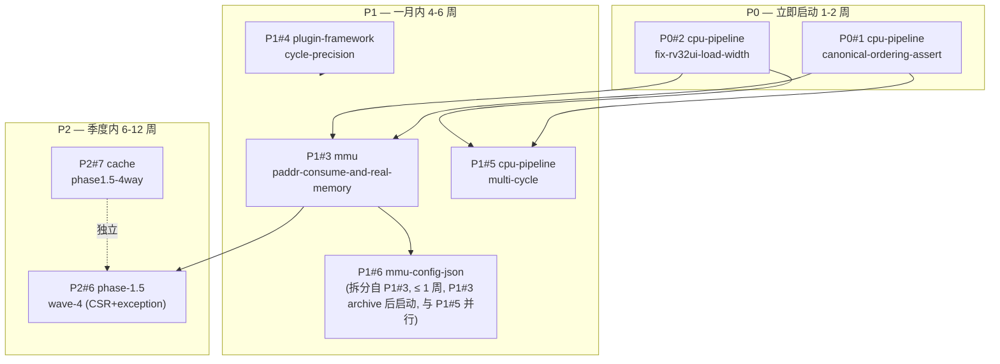

# Strategy: A+C Hybrid — Phase 1.5 收敛 → 产品化前置

> **Status**: ✅ Approved (2026-09-24, v1.1 Oracle/Metis 双审查修订 2026-09-24)
> **决策依据**: Oracle 咨询结论 2026-09-24 + 7 项决策矩阵全 confirm + Metis 预规划审查 v1.0 (10 项修订已应用)
> **目标版本**: ChipForge v0.7.0 → v0.8.0 → v0.9.0 (按 initiative 顺序归档, **Phase 6d 占用 v0.4.0/v0.5.0/v0.6.0 已消费, Phase 1.5 从 v0.7.0 起**)
> **OpenSpec 上下文存储**: `~/.local/share/openspec/context-stores/chipforge/initiatives/`
> **本文档定位**: 战略 SSOT (A+C Hybrid 选择 + 决策矩阵 + 版本节点 + Go/No-Go) — 与执行分解分工：本文件承担"为什么/做什么"（稳定）；[`docs/architecture/roadmap-evolution.md`](../../docs/architecture/roadmap-evolution.md) 承担"怎么做"（架构演进 + 跨版本对比，动态）；`openspec/changes/*/tasks.md` 承担"任务级执行"。

## 1. 战略选择

**A (Productization) + C (Debt-Clear to RV32I 90%) 混合**, 先清债后 Phase 2。

| 战略 | 内容 | 选? | 理由 |
|------|------|-----|------|
| A. 产品化优先 | Phase 2 → 3 → 4 端到端 | ❌ 否决 | 当前 17 个 TLM pre-existing fail 与 4 个 Wave 2 hidden bug 同根, 不清债会重复踩坑 |
| B. 工具化优先 | Phase 6a → 6b | ❌ 否决 | CH_MEM elaboration 刚收官 (v0.3.0/v0.3.1), 过早切工具化会冲销 6c 成果 |
| **C + A 混合** | Wave 3 → 4 清债 → Phase 2 | ✅ **采纳** | 清债到 RV32I 90% 后再切产品化, 既消除技术债又保留项目立项目标 |

## 2. 7 项决策矩阵 (已确认)

| # | 决策点 | 决策 |
|---|--------|------|
| 1 | Initiative 分组 = B (3 wave-based) | ✅ Yes |
| 2 | P1#4 cycle-precision 并入 wave2 而非独立 | ✅ Yes |
| 3 | 战略表 + `sync_strategy_status.sh` 派生脚本 | ✅ Yes |
| 4 | Initiative 落在 `~/.local/share/openspec/context-stores/chipforge` (CLI 强制 XDG, 非 repo 内) | ✅ Yes (与原方案偏离)|
| 5 | AC 1:1 映射 tasks.md section | ✅ Yes |
| 6 | wave4 initiative 现在建占位 | ✅ Yes |
| 7 | 版本号 v0.7.0/0.8.0/v0.9.0 绑 initiative archive (Phase 6d 已消费 v0.4.0/v0.5.0/v0.6.0, 序号跳号) | ✅ Yes |

## 3. Initiative 清单

| Initiative ID | Title | 包含 Change | 版本节点 | Status |
|---------------|-------|-------------|----------|--------|
| `wave3-cpu-pipeline-debt` | Wave 3 CPU Pipeline 清债 | P0#1 canonical-ordering-assert + P0#2 rv32ui LOAD-width (回顾性 v0.6.0) | **v0.7.0** | ✅ 已收官（archived, commit cba5e53 + 8909165 + d98a9dd） |
| `wave3-mmu-real-memory-and-cycle` | Wave 3 MMU 实内存 + 周期精度 | P1#3 mmu-paddr-consume + P1#4 cycle-precision + P1#5 multi-cycle + **P1#6 mmu-config-json-driven** (拆分自 P1#3, P1#3 archive 后启动, 与 P1#5 并行) | **v0.8.0** | 🟡 **部分收官（2026-09-29 Oracle 审计）**：P1#3 已 archive（commit 8a14402）；P1#5 被 wave5 `mfc-cpu-pipeline-multi-cycle-fsm` supersede（8/60 IN_PROGRESS）；**P1#4 0/25 NOT STARTED, Phase F optional**（2026-09-29 (b) 决策降级, Oracle 审计代码考古零痕迹: 无 CURRENT_CYCLE/cycle_count_t/test_pb_run_cycle_precision.cpp/ADR-050）；P1#6 满足启动条件（P1#3 已 archive）待启动。**Initiative 形式 archive 待 P1#4 Phase F 实装 + P1#6 archive** |
| `wave4-csr-cache-dse` | Wave 4 CSR/异常 + Cache DSE | P2#6 phase-1.5-wave-4 + P2#7 cache 64×4 LRU | **v0.9.0** | exploring (占位) |
| **`wave5-isa-coverage-and-bp`**（**新增 2026-09-27**）| Wave 5 ISA 覆盖 + 分支预测 + S/U mode | P3#8 mfc-cpu-pipeline-multi-cycle-fsm + P3#9 cpu-pipeline-rv32c-decode + P3#10 cache-icache-fence-i + P3#11 cpu-pipeline-smode-umode + P3#12 cpu-pipeline-amo-lrsc + P3#13 cpu-pipeline-bp-btb-gshare + P3#14 soc-freertos-demo + ADR-070~083（14 条新规划，含 083=write-back FSM 净新增） | **v0.10.0 → v1.0.0** | exploring（待启动）；详见 [`docs/architecture/roadmap-evolution.md` §4-§5](../../docs/architecture/roadmap-evolution.md) |
| **`wave6-linux-and-productization`**（**2026-10-09 标记, v1.0.0+ 远期**）| Wave 6 Linux + chip-selector 商业化 | P4#15 vexii-riscv-parity-poc (远期 placeholder, v1.0.0+ 启动期启用) | **v1.0.0 → v1.3.0** | deferred (wave6 启动期启用); 详见 [`docs/architecture/roadmap-evolution.md` §5-§7](../../docs/architecture/roadmap-evolution.md) |

## 4. 依赖图

## 5. 战略柱映射

| 柱 | 覆盖 Change | Initiative |
|----|-------------|------------|
| Debt-Clear (A前) | P0#1, P0#2 | `wave3-cpu-pipeline-debt` |
| End-to-End Real | P1#3, P1#4, P1#5, **P1#6** | `wave3-mmu-real-memory-and-cycle` |
| Phase 2 前置 | P2#6, P2#7 | `wave4-csr-cache-dse` |
| **ISA 覆盖 + RTOS** | P3#8~14 + ADR-070~082 | **`wave5-isa-coverage-and-bp`** |
| **Linux + 商业化**（**2026-10-09 新增**）| P4#15 + ADR-079~080 | **`wave6-linux-and-productization`** |

## 6. 版本节点

| 版本 | 触发条件 | 预期日期 |
|------|----------|----------|
| **v0.7.0** | `wave3-cpu-pipeline-debt` archive | 2026-09-25 ✅ 已 archive |
| **v0.8.0** | `wave3-mmu-real-memory-and-cycle` archive (含 P1#6 拆分) | 2026-12 中旬 (依赖 v0.7.0 + 5-7 周, P1#3 + P1#4 启动 + P1#5 依赖 P1#3 + P1#6 与 P1#5 并行, ≤ 1 周) |
| **v0.9.0** | `wave4-csr-cache-dse` archive | 2027-02 下旬 (依赖 v0.8.0 + 6-10 周, 含 umbrella 拆分 + cache 4-way) |
| **v0.10.0** | `wave5-isa-coverage-and-bp` 部分 archive (mfc Phase H + mmu-chmem Phase A-E + rv32um 覆盖) | 2027 Q1 (依赖 v0.9.0 + Phase 6d + 3-5 个并行 change) |
| **v0.11.0** | `wave5-isa-coverage-and-bp` 收官 (rv32um 8/8 + BP) | 2027 Q1 末 (依赖 v0.10.0 + mfc-extract-fsm-h + bp-btb-gshare) |
| **v1.0.0** | `wave5-isa-coverage-and-bp` S/U mode + FreeRTOS | 2027 Q3 (依赖 v0.11.0 + ADR-070~076 + 4-5 个月) |
| **v1.2.0** | 4-way RRIP + PMP + Debug + Spike lockstep + Linux-sim SOFT | 2028 Q2 (依赖 v1.0.0 + 12-15 个月) |
| **v1.3.0** | `wave6-linux-and-productization` Linux-on-FPGA + chip-selector | 2029 Q1 (依赖 v1.2.0 + chip-selector PoC + ADR-080 转硬门禁) |

## 7. 状态总表 (SSOT)

> ⚠️ **本表**由 `.rddf/sync_strategy_status.sh` 从 `openspec initiative show <id> --store chipforge` 输出**派生再写入**, 禁止手改。
> 文档维护人员: 任何时候修改本表前必须先运行 `bash .rddf/sync_strategy_status.sh`。
>
> **migrated 2026-10-09**: 原 `tools/sync_strategy_status.sh` (写入 `docs/roadmap/strategy/a-plus-c-hybrid.md`) 已迁移到 `.rddf/sync_strategy_status.sh` (写入本文件 §7), 同步机制不变, 仅 SSOT 位置变更。

<!-- AUTO-GENERATED by .rddf/sync_strategy_status.sh — do not edit -->

| Change | Initiative | Priority | Status | Tasks |
|--------|-----------|----------|--------|-------|
| `2026-09-24-cpu-pipeline-canonical-ordering-assert` | wave3-cpu-pipeline-debt | P0 | ✅ DONE (archived) | 1 22 |
| `2026-09-24-cpu-pipeline-fix-rv32ui-load-width` | wave3-cpu-pipeline-debt | P0 | ✅ DONE (archived) | 0 18 |
| `2026-09-26-mmu-paddr-consume-and-real-memory` | wave3-mmu-real-memory-and-cycle | P1 | ✅ DONE (archived) | 0 36 |
| `2026-10-05-cpu-pipeline-multi-cycle` | wave3-mmu-real-memory-and-cycle | P1 | ✅ DONE (archived) | 27 0 |
| `2026-10-08-mmu-config-json-driven` | wave3-mmu-real-memory-and-cycle | P1 | ✅ DONE (archived) | 0 0 |
| `2026-10-08-plugin-framework-cycle-precision` | wave3-mmu-real-memory-and-cycle | P1 | ✅ DONE (archived) | 19 0 |
| `phase-1.5-wave-4` | wave4-csr-cache-dse | P2 | TODO | 41 0 |
| `2026-10-08-cache-phase1.5-4way` | wave4-csr-cache-dse | P2 | ✅ DONE (archived) | 32 0 |
| `2026-10-08-verilator-l1cache-e2e-coverage` | wave4-csr-cache-dse | P2 | ✅ DONE (archived) | 52 0 |
| `mfc-cpu-pipeline-multi-cycle-fsm` | wave5-isa-coverage-and-bp | P1 | IN_PROGRESS (50/60) | 10 50 |
| `mfc-extract-fsm-h` | wave5-isa-coverage-and-bp | P2 | TODO | 15 0 |
| `mmu-chmem-pipeline-integration` | wave5-isa-coverage-and-bp | P1 | IN_PROGRESS (6/165) | 159 6 |
| `2026-09-28-cpu-factory-satp-mapping` | wave5-isa-coverage-and-bp | P1 | ✅ DONE (archived) | 24 4 |
| `2026-09-28-debug-cpu-l1-mmu-demo-deep-rca` | wave5-isa-coverage-and-bp | P1 | ✅ DONE (archived) | 19 0 |
| `2026-09-28-debug-cpu-l1-mmu-demo-paddr-regression` | wave5-isa-coverage-and-bp | P0 | ✅ DONE (archived) | 3 20 |
| `2026-10-05-verilator-cpu-factory-extensible-params` | wave5-isa-coverage-and-bp | P1 | ✅ DONE (archived) | 5 42 |
| `2026-10-05-verilator-mmu-bare-plumbing-e2e` | wave5-isa-coverage-and-bp | P2 | ✅ DONE (archived) | 0 42 |
| `2026-10-06-cpu-pipeline-mmufault-handler` | wave5-isa-coverage-and-bp | P1 | ✅ DONE (archived) | 0 7 |
| `2026-10-07-mfc-defer-v0.11.0` | wave5-isa-coverage-and-bp | P0 | ✅ DONE (archived) | 6 10 |
| `2026-10-08-mmufault-verilator-sv32-e2e-flip` | wave5-isa-coverage-and-bp | P1 | ✅ DONE (archived) | 36 0 |
| `vexii-riscv-parity-poc` | wave6-linux-and-productization | P1 | TODO | 74 0 |

> **Status 解读**:
> - `TODO`: tasks.md 全部 open 或不存在
> - `IN_PROGRESS (N/M)`: 部分完成
> - `DONE`: tasks.md 全部 checked
> - `✅ DONE (archived)`: 已 archive 到 `openspec/changes/archive/`
<!-- end AUTO-GENERATED -->

## 8. 风险 (Oracle/Metis 双审查共识)

| 风险 | 缓解 |
|------|------|
| 战略表手维护漂移 | 强制脚本派生, 文档标 "do not edit" |
| Initiative schema 太薄 | 仅存 id/title/summary, 详情靠 markdown, CI grep + 人审兜底 |
| P2 占位腐化 | P1 执行期同步修订 wave4 placeholder |
| Mega 耦合 (A 方案) | 已规避 (B 方案) |
| 柱分组虚假同柱 (C 方案) | 已规避 (B 方案) |
| P0#1 跨 TU 静态计数器 BUG (Metis #1 CRITICAL) | D1=A 改用 `inline int` (C++17 inline variable), 已在 proposal §R1 标注 |
| sync_strategy_status.sh 数据丢失 (Metis #5 CRITICAL) | 加备份 `.bak` + marker 完整性验证 + awk 子串匹配 (容忍空格差异), 已实装 |
| **rdd-workflow 迁移期 sync 脚本双写期**（**2026-10-09 新增**）| `.rddf/sync_strategy_status.sh` 写入本文件 §7, 老 `tools/sync_strategy_status.sh` 保留 1 周观察期后废弃 (过渡期老脚本写老路径, 产生 stale; 验证命令: `bash tools/sync_strategy_status.sh --dry-run` vs `bash .rddf/sync_strategy_status.sh --dry-run` 输出一致) |

## 9. 已知缺漏 (双审查共识, 不在本战略范围)

| # | 缺漏 | 影响 | 处理 |
|---|------|------|------|
| **L1** | ~~`7stage_add_elf_end_to_end` superscalar cpu_sim segfault (v0.2.2 起 pre-existing)~~ | **已修复** (`b82af0f` CpuFactory 7stage superscalar `lane_counters` use-after-free + v0.7.0 P0#1 canonical-ordering 沉淀); [cpu-integration] 5 个 case 含 "7stage" 全 PASS | 闭合 [✅ v0.7.0/v0.10.0 双锁] (无后续 action) |
| **L2** | `ip/cpu` 老 IP 不遵守标准 IP 文档结构 (无 `ip/cpu/docs/` 等) | 文档债务累积 | 推迟 wave4 完成后 cleanup change (1 天) |
| **L3** | TLM deprecation 路径不清晰 (ADR-040 v3.0 §1260 已标 `pb.run()` deprecated, 但 wave3 全基于 TLM) | 用户预期混乱 | 战略级澄清: TLM 与 CH_MEM 并存**至少到 v1.0.0**, CH_MEM 是 Phase 6d+ 主路径, TLM 是兼容基线 |
| **L4** | ~~MUL/DIV riscv-tests ELF 完全缺失 (Metis #4)~~ | [✅ v0.10.0 已闭环: commit `b12c920` vendor mul/div manual_elf + mfc Phase A in-context (commit `4c3b796`)] | 闭合 (无后续 action) |
| **L5** | rv32mi-p (CSR/trap) ELF 是否已 vendor 未验证 | P2#6 测试基线缺 | wave4 P2#6 启动前 vendor `tests/cpu/riscv_tests/build_rv32mi.sh` |
| **L6** | ~~17 pre-existing TLM fail 根因未分析 (commit `7d310c6` 之后稳定但 17 个 fail 来源不明)~~ | [✅ v0.10.0/1/2 hotfix 已闭环 0 fail: v0.10.0 paddr-regression (commit `6a0d506`) + v0.10.1 deep-rca workaround `enable_mmu=false` + v0.10.2 cpu-factory-satp-mapping (commit `9070ceb`) 修 cpu_factory.h:390] | 闭合; 剩余 cpu-pipeline-mmufault-handler P1 跟踪 (真 sv32 e2e 翻转) |

## 10. Go/No-Go 决策点 (Metis Hidden Intentions 修订)

> **关键认识**: 战略启动后, 每个版本节点触发 Go/No-Go 决策, 中止条件明确, 不隐性吞噬时间盒。

| 节点 | Go 条件 | No-Go 动作 |
|------|--------|----------|
| v0.7.0 archive | P0#1 canonical-ordering PASS + 0 新 fail | 暂停, 修复 P0#1 后重试 |
| v0.8.0 中间检查 | P1#3 PADDR 真消费 + cycle-precision 实装 + multi-cycle stall 注 | **如果评估显示剩余 debt 超预期**: 中止 Phase 1.5, 直接切 Phase 2 (riscv-tests RV64GC) |
| v0.9.0 archive | Phase 1.5 毕业标准达成 (RV32I ≥85%, SoC demo ≥5 ELF tohost=1, cache-dse-sweep CSV, D4+ADR-040+ADR-044+ADR-045 全合规) | 推迟 1 个 wave, 回填 Open Questions, 重审 |
| v0.10.0 archive | mfc Phase H archive + mmu-chmem Phase A-E + rv32um 8/8 + DMIPS/MHz ≥1.4 | 推迟 v0.11.0, 修 mfc-extract-fsm-h 残留 |
| v1.0.0 archive | S/U mode + RV32A + BTB + FreeRTOS + CoreMark ≥2.3 | 推迟 v1.2.0, 修 PoC-6 BP 不足 |
| v1.2.0 archive | lockstep 1M 零分歧 HARD + Linux-sim SOFT + 4-way RRIP + PMP + gdbstub | 触发 R6: 降级 v1.2.0 为"验证基建版", Linux-sim 并入 v1.3.0 合并交付 |
| v1.3.0 archive | Linux-on-FPGA + chip-selector + ADR-080 转硬门禁 + FPGA CoreMark ≥2.5 | 触发 R3/R7/R8: 商业化定位降级 / soft-float 路线 / FPGA-only 产品化 |

## 10.5 v1.4+ 候选（migrated 2026-10-09: 收容原 §3.3/§3.4 中 v1.4+ 内容）

> **目的**: PoC-12 / PoC-15 / R4 在 v1.0.0–v1.3.0 objective 体系外（v1.4+ 远期），原 execution-roadmap 已有但 objectives 止于 v1.3.0，迁移时无归属。本节收容直至 `objective-v140-launch` 创建。

### PoC-12 dual-issue 7stage 预研（v1.4.0 候选）

| 字段 | 内容 |
|------|------|
| 关联 ADR | 081（候选）|
| 关联 change | **待创建** `cpu-pipeline-dual-issue`（v1.4.0 启动期） |
| 成功标准 | single baseline IPC=1.0 归一；dual 实测 **IPC≥1.55**、FMAX **>120 MHz Artix-7**、LUT ≤1.8x；绕过 `at_stage` 的裸指针点 **≤8 处** |
| 失败砍分叉 | IPC<1.35 或裸指针 >8 处 → **理由 #2 信号 1/2 触发**：砍 dual-issue，v1.4 转向 single+late-alu 保 FMAX |

### PoC-15 VexiiRiscv dual 全家桶对拍（HARD 候选）

| 字段 | 内容 |
|------|------|
| 关联 ADR | **090**（拟新增） + 040 + 080 + 083 |
| 关联 change | **已创建** [`vexii-riscv-parity-poc`](../../openspec/changes/vexii-riscv-parity-poc/)（proposal 4/4 完成）|
| 成功标准 | **dual 全家桶**（dual-issue + HW prefetch + write-back + store buffer）**CoreMark/MHz ≥ 4.5**（[估]），**与 VexiiRiscv dual+prefetch 官方 5.24 偏差 ≤15%**（v1.4+ archive gate）；mispredict 率 ~3-5%；DMIPS/MHz ≥ 2.4（追平 VexiiRiscv 2.50 的 96%）|
| 失败砍分叉 | 偏差 > 15% 持续 8 周 → 砍 dual-issue 分叉（理由 #2 信号 2），v1.4 转 single+late-alu；dual 全家桶永不实装 → PoC-15 标 archived-skipped（**不阻塞 PoC-14**）；FPGA 不可综合 → 走 sim-only，FPGA 综合推迟 v1.4+ |

### R4 PoC-12 dual-issue 砍分叉（来源：`docs/research/poics-and-risks.md §3`）

| 字段 | 内容 |
|------|------|
| 触发信号 | IPC < 1.35 或裸指针 > 8 处 |
| 砍分叉 | 砍 dual-issue，v1.4 改 single + late-alu 保 FMAX 路线 |

> **完整反向决策树 + 触发后动作**见 [`docs/research/poics-and-risks.md`](../../docs/research/poics-and-risks.md) §3。

## 11. 执行分解

> 战略 §1-§10 是**为什么/做什么**（稳定）。本文档之外的执行拆解（阶段 / 依赖 / 并行轨道 / 阻塞 / 待启动决策点）见:
>
> 📍 **[`docs/architecture/roadmap-evolution.md`](../../docs/architecture/roadmap-evolution.md)** — 7 版本节点架构演进 + 跨版本对比 + 11 条 CI 门禁时间轴（动态执行分解）
>
> 📍 **[`.rddf/roadmap/`](.)** — rdd-workflow 实施规划（phases/features/objectives）
>
> 关联: `openspec/changes/*/tasks.md` (具体 changes) · `.rddf/sync_strategy_status.sh` (§7 SSOT 派生) · `AGENTS.md` 已知测试状态（数字维护原则）
