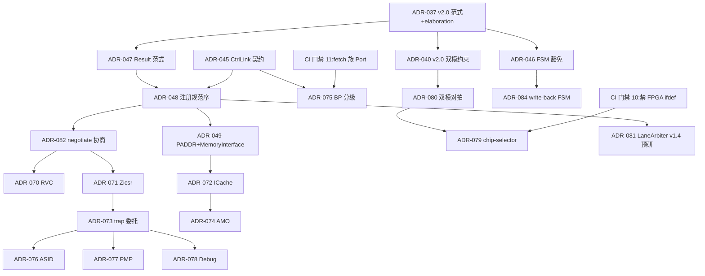
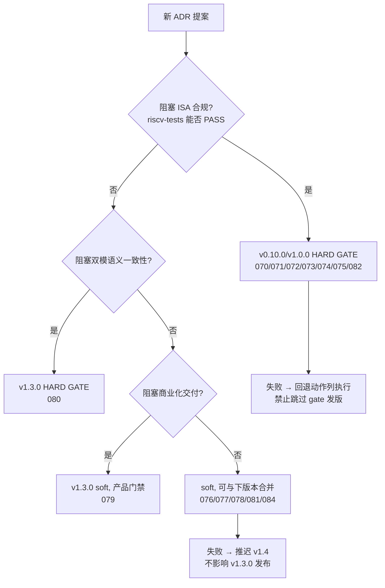

# Reference 2：ADR 落地矩阵（8 条已落地 + 10 条规划中 + 3 条候选 + 2 CI 门禁）

> **主控文档**：[`docs/architecture/roadmap-evolution.md`](../architecture/roadmap-evolution.md) §2 决策 + §3 实施路径
> **关联**：ADR 文档源 [`../../architecture/adr.md`](../architecture/adr.md)

---

## 1. 编号约定（2026-09-26 重构）

| 编号段 | 分配 | 当前占用 |
|--------|------|---------|
| **ADR-001 ~ ADR-049** | 已落地 ADR | 037v2.0 / 040v2.0 / 043 / 045 / 046 / 047 / 048 / 049（7 条）|
| **ADR-050 ~ ADR-051** | active change 占用 | plugin-framework-cycle-precision（pb-run-cycle-precision）/ cpu-pipeline-multi-cycle（plugin-latency-table）|
| **ADR-052 ~ ADR-069** | wave3/wave4 active change 备用 | 待 wave3 archive 后分配 |
| **ADR-070 ~ ADR-084** | 本路线图新规划段 | 070=RVC / 071=Zicsr / 072=ICache / 073=trap / 074=AMO / 075=BP / 076=ASID / 077=PMP / 078=Debug / 079=chip-selector / 080=双模对拍 / 081=LaneArbiter / 082=negotiate / 084=write-back FSM。**083 = Plugin-style SSOT（已被 adr.md 注册，从本规划段移除）** |

---

## 2. 21 条 ADR 整合矩阵（8 已落地 + 10 规划中 070–080 + 3 候选 081–082/084）

| ADR | 标题 | 决策依据 | Owner IP | 版本绑定 | 依赖前置 | 硬/软门禁 | PoC 验证范围 | 失败回退动作 |
|-----|------|----------|----------|----------|---------|------------|--------------|--------------|
| **037 v2.0** | Plugin 设计范式 + elaboration 语义 | Phase 6c M5 实测 DAG 发射可行 | 框架 | v0.3.0 ✅ | 无 | **硬**（CI verify_plugin_decision） | `[elaborate]` 4 API PoC | 退 v1.0 |
| **040 v2.0** | TLM↔CH_MEM 双模移植约束 | CH_MEM 翻转为新正道 | 框架 | v0.3.0 ✅ | 037 | **硬**（check_plugin_portability 12 check） | `[chmem]` 9/9 + pipeline2 stall matrix 16/16 | 冻结 CH_MEM |
| 043 | CI 架构门禁 | 人审不可扩展 | 流程 | v0.1.x ✅ | 无 | **硬**（PR 阻塞） | 3 脚本全绿 | 逐条灰度 |
| 045 | CtrlLink 消费契约 + stall loop | stall 语义需统一 | 框架 | v0.1.3 ✅ | 037 | 硬 | stall/flush 矩阵 | — |
| 046 | 多周期 FSM 豁免 D4 | MMU/PTW/refill 无法用无 FSM 表达 | 框架 | Phase 6c ✅ | 037 | **硬**（grep+DSL） | PTW 5 态 + L1 refill 4 态 | 豁免>20 触发理由 #3 信号 2 |
| 047 | 静态配置 Result 范式 | 配置错误需 elaboration 期 fail-fast | 框架 | v0.6.0 ✅ | 037 | 硬 | 10 API 全 Result 化 | — |
| 048 | Plugin 注册规范序 | 隐式注册序 = VexRiscv 病灶 #3 | cpu | v0.7.0 ✅ | 045/047 | **硬**（运行时断言） | canonical_ordering 4 测试 | — |
| 049 | MMU PADDR 契约 + MemoryInterface | PTW 真内存读需总线解耦 | mmu/memory | v0.8.0 ✅ | 045 | 硬（契约断言） | `[cpu-l1-mmu-demo]` 6 用例 | — |
| **070** | RVC 解码（2-phase + 对齐缓冲） | Linux 生态事实需要 C | cpu/decode | **v0.10.0** | 048 + 082 | **硬**（riscv-tests rv32uc 阻塞） | PoC-2 | 跨页 fetch 禁行 → 保守路径 |
| **071** | Zicsr/Zifencei 合规模型 | spec 2.0 拆分后工具链硬性要求 | cpu/csr | **v0.10.0** | 无（可与 070 并行） | **硬**（新 GCC 编译不过 = 阻塞） | PoC-1 顺带 | fence.i 全冲刷降级 |
| **072** | ICache 结构 + fence.i 一致性 | 无 I$ 则 Linux 性能不可接受 | cache | **v0.10.0** | 049 | **硬**（CoreMark 回归门禁） | PoC-3 | fence.i 全冲刷；I$ 容量减半 |
| **073** | 特权架构 trap 委托真值表 | Linux 需要 S/U + 委托 | cpu/csr | **v1.0.0** | 071 | **硬**（rv32si 测试阻塞） | PoC-4 | medeleg 全零降级（M-mode 独揽） |
| **074** | AMO/LR/SC 单核语义 | RV32A 解锁 Linux 用户态 | cpu/lsu | **v1.0.0** | 072（D$ 通路上） | **硬**（rv32ua 阻塞） | PoC-5 | AMO 退化临界区 + reservation word 粒度 |
| **075** | 分支预测分级（BTB→GShare→RAS） | 理由 #1 演进方案 | cpu/fetch | **v1.0.0** | 045（flush 走 CtrlLink） | **硬**（CoreMark ≥1.9 门禁） | PoC-6 | 砍 GShare 保 BTB；bp_mode=static 兜底 |
| 076 | ASID vs 全局 TLB 冲刷 | v1.x 复杂度预算 | mmu | v1.2.0 | 049 | 软 | PoC-8 内 | 全局冲刷 + ASID 字段留 hook |
| 077 | PMP 8 表项 NAPOT | 嵌入式安全基线 | cpu/csr | v1.2.0 | 073 | 软 | PoC-8 内 | 表项数砍到 4；PMP 整体推迟 v1.4 |
| 078 | Debug 最小侵入（gdbstub 先） | 调试是产品化门槛 | soc/debug | v1.2.0 | 073 | 软 | PoC-10 | JTAG DTM 推迟，仅留 gdbstub |
| **079** | Chip-selector 工具契约 | 决策 3 商业化载体 | tools | **v1.3.0** | 040/080 | 软（产品门禁） | PoC-11 | 工具降级为脚本集，不发布独立 CLI |
| **080** | 双模对拍 CI 协议 | 理由 #5 演进方案，双模制度化 | 流程 | v1.2 试点 → **v1.3.0 硬** | 040 | 试点期软 → v1.3.0 **硬** | PoC-9 | 对拍降级核心指令流 |
| 081（候选） | LaneArbiter 多 lane 仲裁 | 理由 #2 演进方案 | cpu | v1.4.0 预研 | 048 | 软 | PoC-12 | 砍 dual-issue 分叉 |
| **082**（候选） | negotiate() capability 协商 | 理由 #3 唯一真实缺口 | 框架 | **v0.10.0 内嵌** | 047/048 | **硬**（dynamic_cast=0 grep） | PoC-1–3 全部经由 negotiate 组装 | 重做本 API 单点，不升级范式 |
| 084（候选） | Write-back D$ + Store buffer | 理由 #4 演进方案 | cache | v1.x 候选 | 046/072 | 软 | write-back FSM 6 态 | 降级 write-through + write buffer |
| **CI 第 10 条** | 核内禁 `#ifdef FPGA` | 决策 2 硬约束 | 流程 | **v0.10.0** 起效 | 无 | **硬**（PR 阻塞） | grep 全仓 0 命中 | 删除违规宏 + 收 MemoryInterface 适配 |
| **CI 第 11 条** | fetch 族 Port 通信强制 | 决策 1 理由 #1 | 流程 | **v1.0.0** 起效 | 075 | **硬** | grep 跨 Plugin 直引 ≤2 条 | 演进 Port 抽象 |

---

## 3. ADR 依赖图

---

## 4. 门禁分层决策树

---

## 5. ADR 文件位置约定

| 类型 | 位置 |
|------|------|
| 框架级 | `docs/architecture/adr/ADR-0NN-<slug>.md`（含 070/071/073/074/075/082） |
| IP 级 | `ip/cache/docs/adr/ADR-072-...`、`ip/mmu/docs/adr/ADR-076-...` |
| 流程级 | `docs/architecture/adr/ADR-079-chip-selector.md` / `ADR-080-dual-mode-coverage.md` / `ADR-043-ci-gate.md`（与 043 同级）|

---

## 6. CI 门禁清单（11 条）

> **编号双轨说明（2026-09-27 校准）**：下表 # 列 = §6 行号（canonical 引用基准）；括号内 "第 N 条" = 历史命名（如 `(第 10 条)` = 决策 2 ASIC 友好的原始命名），与 §6 行号错位（§6 行 4 = "第 10 条"、行 5 = "第 8 条"、行 10 = "第 11 条"）。**外部引用（`roadmap-evolution.md §9.1` 等）统一使用 §6 行号**。

| # | 门禁 | 检查内容 | 实施版本 |
|---|------|---------|---------|
| 1 | `verify_adr.sh` | ADR ↔ 代码对齐（含已落地 8 条） | ✅ 已生效 |
| 2 | `verify_plugin_decision.sh` | D4 9 项 | ✅ 已生效 |
| 3 | `check_plugin_portability.sh` | ADR-040 v2.0 双模约束 12 check | ✅ 已生效 |
| 4 | (历史: 第 10 条) | 核内禁 `#ifdef FPGA` / `XILINX` / `ALTERA` | **v0.10.0 起效** |
| 5 | (历史: 第 8 条) | `build()` 内 `dynamic_cast` = 0（ADR-082 生效 enforcement）| **v0.10.0 起效** |
| 6–9 | (各 PoC 相关) | 见各 PoC ADR 锚点列（v0.10.0 起随 PoC 起效） | 随 PoC 起效 |
| 10 | (历史: 第 11 条) | fetch 族 Port 直引 ≤2 条 | **v1.0.0 起效** |
| 11 | (ADR-080 硬门禁) | 双模对拍 match 100% | **v1.3.0 硬门禁**（v1.2.0 试点）|

**计数核算**：3 已生效 + 2 (v0.10) + 4 (PoC 挂钩) + 1 (v1.0) + 1 (v1.3) = **11 条**。

---

## 7. 历史对照（原 050~062 → 现 070~082 平移说明）

| 原编号 | 新编号 | 标题 | 备注 |
|--------|--------|------|------|
| ADR-050 | **ADR-070** | RVC 解码 | 原规划被 active change 占用（plugin-framework-cycle-precision 用 ADR-050），整体平移 +20 |
| ADR-051 | **ADR-071** | Zicsr/Zifencei | 原规划被 active change 占用（cpu-pipeline-multi-cycle 用 ADR-051），整体平移 +20 |
| ADR-052 | **ADR-072** | ICache | +20 |
| ADR-053 | **ADR-073** | trap 委托 | +20 |
| ADR-054 | **ADR-074** | AMO | +20 |
| ADR-055 | **ADR-075** | BP 分级 | +20 |
| ADR-056 | **ADR-076** | ASID | +20 |
| ADR-057 | **ADR-077** | PMP | +20 |
| ADR-058 | **ADR-078** | Debug | +20 |
| ADR-059 | **ADR-079** | chip-selector | +20 |
| ADR-060 | **ADR-080** | 双模对拍 | +20 |
| ADR-061 | **ADR-081** | LaneArbiter | +20 |
| ADR-062 | **ADR-082** | negotiate | +20 |

平移原因：active change（plugin-framework-cycle-precision + cpu-pipeline-multi-cycle）已占用 ADR-050/051，避免冲突必须整体让位。新段从 070 起连续分配，把 052–069 留给 wave3/wave4 active change 消化。

**净新增 ADR-084（write-back FSM）**：无原 050~062 对应编号，为 v1.x 候选 ADR 增量（理由 #4 演进方案），单独占 070~084 段尾。
编号 083 让位给 adr.md 已注册的 ADR-083（Plugin-style SSOT）。
完整计数：**070~084 = 13 平移 + 1 净增 = 14 条**。