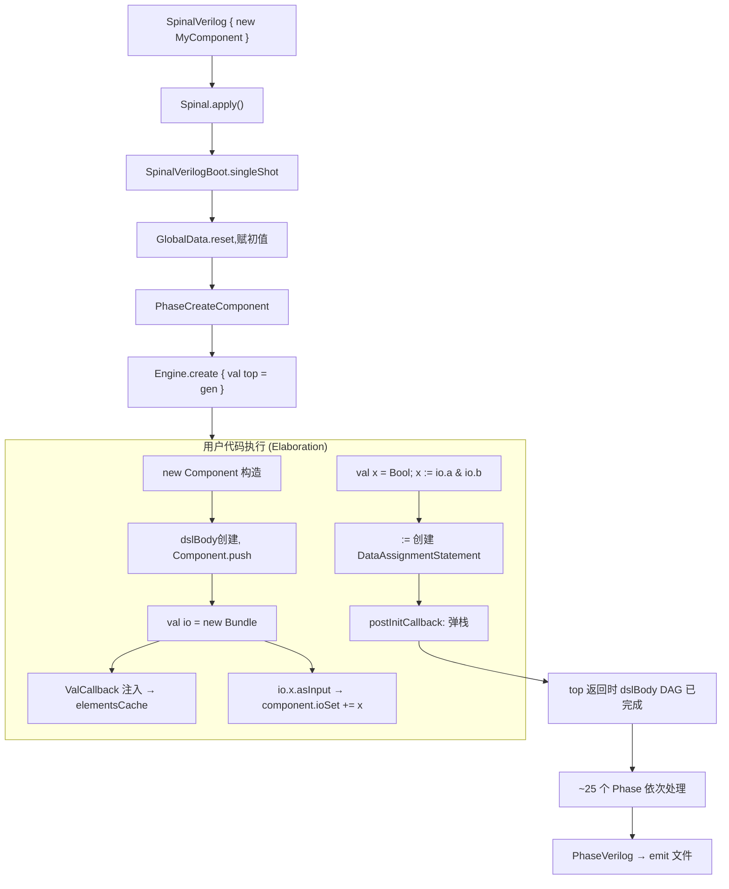

# CppHDL Elaboration 模式研究 — Phase 6c 技术报告

> 研究日期：2026-09-16
> 目标仓库：`/workspace/project/CppHDL/`（SpinalHDL 的 C++ 移植版）
> 用途：ChipForge Phase 6c — 将 `cf::plugin`（C++ Plugin 框架）改造为 elaboration DSL，复用 CppHDL 后端

---

## 1. 核心思想：C++ 构造期 = 硬件生成期

CppHDL 的 elaboration 可以概括为**"构造就是生成"**——执行 `ch_device<Top>` 的构造函数，就是跑完整个 elaboration，生成完整的 DAG IR。没有 `run()` 步骤、没有 tick 函数。

数据流全貌：

```
ch_device<Top>(args...)
  ├── context ctx("top_ctx")              ← 创建"井"
  ├── ctx_swap guard(&ctx)                ← ctx_curr_ = &ctx
  ├── new Top()                            ← 执行构造体
  │     ├── __io(ch_in<...>; ch_out<...>)  ← 端口节点落地到 ctx
  │     └── top_->build()                  ← 入口
  │           ├── create_ports()           ← placement new io_type
  │           └── describe()               ← 用户硬件描述
  │                 ├── ch_reg<T>(0_d)     ← regimpl + proxyimpl 落地
  │                 ├── reg->next = ...    ← DAG 建边
  │                 ├── io().val = reg     ← output 建边
  │                 └── ch_module<Sub>(...)← 递归 build
  └── toVerilog("file.v", ctx)             ← DAG → Verilog
```

---

## 2. 关键架构组件

### 2.1 `context` — Elaboration 井

**位置**：`include/core/context.h`（170 行）

`context` 是 CppHDL 硬件的"容器"——所有 DAG 节点都归他管。

| 组件 | 作用 |
|------|------|
| `node_storage_` | `vector<unique_ptr<lnodeimpl>>`，所有节点的归宿 |
| `create_node<T>(args...)` | 统一工厂：分配 ID、push 到 storage、返回裸指针 |
| `current_clock()` / `current_reset()` | 时钟域（单时钟域约束 ADR-008） |
| `default_clock_` / `default_reset_` | 默认时钟/复位 |

**thread_local 机制**：

```cpp
extern thread_local context *ctx_curr_;

struct ctx_swap {
    context *old_ctx_;
    explicit ctx_swap(context *new_ctx) : old_ctx_(ctx_curr_) { ctx_curr_ = new_ctx; }
    ~ctx_swap() { ctx_curr_ = old_ctx_; }
};
```

`ctx_swap` 是 RAII guard——构造时设 `ctx_curr_`，析构时恢复。这让 CppHDL 的嵌套 context 切换变成零开销的栈操作，等价于 SpinalHDL 的 Scala implicit scope。

### 2.2 `node_builder::instance()` — 单例工厂

**位置**：`include/core/node_builder.h`（455 行）

Meyers' singleton，所有硬件节点创建的**唯一闸口**：

```cpp
class node_builder {
    static node_builder &instance() {
        static node_builder instance;
        return instance;
    }
    // 每个 build_* 方法：
    // 1) 断言 ctx_curr_ != nullptr
    // 2) 计算 ch_width_v<T>
    // 3) 调用 ctx->create_*() 注入 DAG
    pair<regimpl*, proxyimpl*> build_register<T>(init, name, ...);
    lnodeimpl* build_operation(ch_op, lhs, rhs, result_width, ...);
    lnodeimpl* build_literal(value, name, ...);
    lnodeimpl* build_input<T>(name, ...);
    lnodeimpl* build_output<T>(name, ...);
    lnodeimpl* build_mux(cond, true_val, false_val, ...);
    lnodeimpl* build_bit_select(operand, index, ...);
};
```

**拦截所有入口**：
- `counter_reg + 1_d` → 重载 `operator+` → `node_builder::build_operation(add, ...)`
- `ch_reg<T>(0_d)` → 构造体 → `node_builder::build_register<T>(...)`
- `ch_logic_in<T>()` → 直接 `ctx->create_input(...)`（例外，io.h 绕过 node_builder）

### 2.3 `lnodeimpl` — DAG 节点基类

**位置**：`include/core/lnodeimpl.h`（222 行）

```cpp
class lnodeimpl {
    uint32_t id_;                       // 全局唯一 ID
    lnodetype type_;                    // lit/proxy/input/output/op/reg/mem/mux/...
    uint32_t size_;                     // 位宽
    context *ctx_;                      // 所属 context
    vector<lnodeimpl*> srcs_;          // DAG 前驱（输入边）
    vector<lnodeimpl*> users_;         // DAG 后继（输出边，谁在用我）
    Component *parent_;                 // 所属 Component
    
    uint32_t add_src(lnodeimpl *src);   // 建边 + 自动 add_user
    void set_src(uint32_t idx, ...);    // 更新边 + 自动管理 user 关系
};
```

**建边自动绑定**：`add_src(src)` 自动调用 `src->add_user(this)`，形成双向 DAG 链接。后端 Verilog 生成器靠 `srcs_` 做拓扑排序，优化器靠 `users_` 做死代码消除。

### 2.4 `ch_reg<T>` 非阻塞赋值机制

**位置**：`include/core/reg.h`（84 行）+ `include/lnode/reg.tpp`（101 行）

三层嵌套 proxy 架构：

```
ch_reg<ch_uint<8>> counter_reg(0_d)
  │
  ├─ regimpl_node_ ──→ regimpl 节点
  │     ├─ init_val_ = 0_d (litimpl*)
  │     ├─ next_val_ = nullptr (初始)
  │     └─ proxy_ ──→ proxyimpl 节点（当前值）
  │
  ├─ logic_buffer::node_impl_ ──→ proxyimpl 节点（读操作的目标）
  │
  └─ __next__ ──→ next_proxy<ch_uint<8>>
        └─ next ──→ next_assignment_proxy<ch_uint<8>>
              └─ regimpl_node_ (即 regimpl*)
```

**`reg->next = expr` 的调用链**：

```cpp
// 用户写：
counter_reg->next = counter_reg + 1_d;

// 1. counter_reg.operator->()  → __next__.get()  → next_proxy<...>*
// 2. .next                        → next_assignment_proxy<...> 成员
// 3. = counter_reg + 1_d          → next_assignment_proxy::operator=<U>
//
// 内部实现（reg.tpp:13-31）：
template<typename U>
void next_assignment_proxy<T>::operator=(const U &value) const {
    auto operand = to_operand(value);          // 统一类型擦除
    regimpl *reg_node = static_cast<regimpl*>(regimpl_node_);
    reg_node->set_next(operand.impl());         // 建 DAG 边！
}
```

**不是 C++ 赋值，是 DAG 建边**。`->next = expr` 和 SpinalHDL 的 `reg := expr` 语义等价——都在 elaboration 期建立"寄存器下一周期值"的 DAG 连接。

`<<=` 语法糖：

```cpp
template<typename U> void operator<<=(const U &value) const {
    __next__->next = value;    // 等价于 reg->next = value
}
```

---

## 3. 编译期安全纪律（勘误版，2026-09-17 Oracle review）：

> ⚠️ **重要勘误**：原 §3 "`if(ch_bool)` 编译失败" 结论**不成立**。C++17 contextual conversion（`if`/`while`/`!`/`?:`）**使用** `explicit operator bool()`，`if(ch_bool)` **会编译通过**，且对符号节点静默返回 false（`src/lnode/bool.cpp:51`）。纪律保障**靠 CI grep 兜底，不是类型系统**。

**位置**：`include/core/bool.h`（102 行）

```cpp
struct ch_bool : public logic_buffer<ch_bool> {
    explicit operator bool() const;     // ← 显式，禁止隐式转换
    explicit operator uint64_t() const; // ← 显式
};
```

**实际编译/运行行为**（2026-09-17 修正）：

| 代码 | 行为 | 后果 |
|------|------|------|
| `ch_bool a, b; auto c = a && b;` | ✅ 创建 AND 门 DAG 节点 | 调用重载 `operator&&` |
| `if (c) { ... }`（c 是非常量 ch_bool） | ⚠️ **编译通过 + 静默取 false** | C++17 contextual conversion 触发 `explicit operator bool()`，符号节点恒返 false，**DAG 静默截断** |
| `if ((bool)c) { ... }` | ✅ 仿真期求值 | 显式转型，对非常量同样静默取 false |
| `if (c == true) { ... }` | ✅ 创建 EQ DAG 节点 | 调用 `operator==` 返回 ch_bool |

**核心原则**（修正）：**硬件信号在 elaboration 期是符号（DAG 节点），不是值**。`ch_bool` 的 `explicit operator bool()` 看似禁止隐式转换，但 C++17 contextual conversion 让 `if(ch_bool)` 编译通过，**类型系统不提供任何编译期保护**。elaboration 阶段访问 `ch_bool` 的"值"（`if`/`?:`/`(bool)` cast）一律**静默返回 false**，业务代码一处 `if` 就静默截断 DAG。

**强制手段**：
1. **CI grep**：`tools/check_plugin_portability.sh` v2.0 Check 5 检查 `if (.*ch_bool|halt|stall|flush|en|is_)` 模式
2. **不修改 chlib 类型系统**（`ch_bool` 设计在 Phase 6c 范围外），靠纪律 + grep 兜底
3. **M2 PoC #2 写 1 个故意违规 case** 验证 grep 能抓到（防止 grep 规则本身失效）

这也是 SpinalHDL 的设计：`Bool` 没有隐式 `toBoolean`，必须显式 `toBoolean()`。但**Scala 编译器是 Scala 编译器，C++ 不是 C++ 编译器**——Scala 的 contextual conversion 规则不同（C++17 之前的 contextual conversion 才不调用 explicit 转换）。`ch_bool` 沿用 SpinalHDL 设计但 C++17 行为**与 Scala 不等价**。

---

## 4. 例子对比

### 4.1 counter_simple.cpp × SpinalHDL

**SpinalHDL**：
```scala
class Counter extends Component {
  val io = new Bundle { val value = out UInt(8 bits) }
  val counterReg = RegInit(U(0, 8 bits))
  counterReg := counterReg + 1
  io.value := counterReg
}
```

**CppHDL**（`counter_simple.cpp`）：
```cpp
class Counter : public ch::Component {
    __io( ch_out<ch_uint<8>> value; )
    void describe() override {
        ch_reg<ch_uint<8>> counter_reg(0_d);
        counter_reg->next = counter_reg + 1_d;
        io().value = counter_reg;
    }
};
```

**映射**：

| SpinalHDL | CppHDL | 说明 |
|-----------|--------|------|
| `RegInit(U(0,8))` | `ch_reg<ch_uint<8>>(0_d)` | `0_d` 为字面量模板类型 |
| `:=` | `->next =` | 非阻塞赋值 |
| `out UInt(8 bits)` | `ch_out<ch_uint<8>>` | |
| `io.value := reg` | `io().value = reg` | output 建边 |

### 4.2 Stream FIFO × SpinalHDL

**CppHDL**（`stream_fifo_example.cpp`）：
```cpp
auto fifo = stream_fifo<ch_uint<8>, 16>(input_stream);
// 等价 SpinalHDL: input_stream.queue(16)
// 返回：
//   fifo.push_stream  — 输入端口（payload/valid/ready）
//   fifo.pop_stream   — 输出端口（payload/valid/ready）
//   fifo.occupancy    — 占用计数
//   fifo.full/empty   — 状态标志
```

底层用 `ch_mem<T, N>` + `ch_reg<ch_uint<N>>` 读写指针实现：
```cpp
ch_reg<ch_uint<5>> rd_ptr(0_d), wr_ptr(0_d);
ch_mem<T, 16> mem("fifo_mem");
mem.write(wr_addr, din, push_enable);   // 写端口
auto dout = mem.aread(rd_addr);         // 异步读
```

### 4.3 UART TX + State Machine DSL

`uart_tx.cpp` 展示了 CppHDL 的状态机 DSL（`ch_state_machine<State, NumStates>`），Lambda 回调式状态定义：

```cpp
ch_state_machine<UartTxState, 4> sm;
sm.state(UartTxState::IDLE)
  .on_entry([&]() { shift_reg->next = ch_uint<9>(511_d); })
  .on_active([&]() {
      io().uart_tx = true;
      if (io().frame_start == true) sm.transition_to(UartTxState::START);
  });
sm.set_entry(UartTxState::IDLE);
sm.build();
```

等价 SpinalHDL：
```scala
val sm = new StateMachine {
  val idle = new State with EntryPoint
  idle.whenIsActive { io.uartTx := True; when(io.frameStart) { goto(start) } }
}
```

---

## 5. 内存模型 `ch_mem<T, N>`

**位置**：`include/core/mem.h`（306 行）

| 方法 | 语义 | SpinalHDL |
|------|------|-----------|
| `mem.aread(addr)` | 异步读，组合逻辑输出 | `readAsync(addr)` |
| `mem.sread(addr, enable)` | 同步读，时钟沿输出 | `readSync(addr, enable)` |
| `mem.write(addr, data, enable)` | 写端口 | `write(addr, data, enable)` |
| `ch_mem::make_rom(data)` | ROM 工厂 | `Mem(...).init(seq)` |

每个读/写操作返回端口代理对象（`read_port` / `write_port`），read_port 可隐式转为 `lnode<T>` 用于运算连接。

---

## 6. Bundle 系统（SpinalHDL Bundle 对应）

### 6.1 `bundle_base<Derived>` — CRTP 基类

**位置**：`include/core/bundle/bundle_base.h`（335 行）

```cpp
template<typename Derived> class bundle_base : public logic_buffer<Derived> {
    bundle_role role_ = unknown;
    Derived& operator<<=(Derived& src);  // 字段级智能连接
    void as_master(); void as_slave();
    virtual void as_master_direction();
    virtual void as_slave_direction();
};
```

**智能方向连接**：`<<=` 操作符根据每个字段的 input/output 方向自动决定驱动方向。接收方 output 字段由发送方驱动，接收方 input 字段驱动发送方。SpinalHDL 的 `connect()` 等价语义。

### 6.2 `ch_stream<T>` 流 Bundle

```cpp
template<typename T> struct ch_stream : public bundle_base<ch_stream<T>> {
    T payload; ch_bool valid; ch_bool ready;
    CH_BUNDLE_FIELDS_T(payload, valid, ready)
    void as_master_direction() { make_output(payload, valid); make_input(ready); }
    void as_slave_direction()  { make_input(payload, valid); make_output(ready); }
    ch_bool fire() const { return valid && ready; }
    auto m2sPipe(); // 1-cycle pipeline
};
```

**对应 SpinalHDL**：
```scala
val s = Stream(UInt(8 bits))
s.valid := ...  s.payload := ...  s.ready := ...
```

### 6.3 chlib/stream.h 函数库

| 函数 | SpinalHDL | 说明 |
|------|-----------|------|
| `stream_fifo<T,N>(in)` | `in.queue(N)` | FIFO 带反压 |
| `stream_throw_when(in, c)` | `throwWhen(c)` | 条件丢弃 |
| `stream_take_when(in, c)` | `takeWhen(c)` | 条件通过 |
| `stream_halt_when(in, c)` | `haltWhen(c)` | 暂停 |
| `stream_fork<T,N>(in)` | `Fork(in)` | 复制 |
| `stream_arbiter_priority(in)` | `StreamArbiter` | 优先级仲裁 |

---

## 7. 流水线库 `chlib/pipeline.h`

| 组件 | 说明 |
|------|------|
| `PipelineStage<DataT>` | 单数据流水线寄存器（stall/flush/reset） |
| `PipelineStageDual<Data, Ctrl>` | 双字段流水线寄存器 |
| `pipeline_reg<N>(d, rst, stall, flush)` | 函数式接口 |
| `PipelineChain<DataT, N>` | N 级流水线链（自动级联） |

控制优先级：`rst > flush > stall > normal`。

---

## 8. 关键 API 映射表

| CppHDL | SpinalHDL | 说明 |
|--------|-----------|------|
| `ch_device<T>(args)` | `SpinalVerilog(new T)` | 顶层入口 |
| `Component::describe()` | `Component` 构造体 | 硬件描述体 |
| `ch_in<T>` / `ch_out<T>` | `in(T)` / `out(T)` | IO 端口 |
| `ch_reg<T>(init)` | `RegInit(T(init))` | 带初值寄存器 |
| `reg->next = expr` | `reg := expr` | 非阻塞赋值 |
| `io().field = expr` | `io.field := expr` | 端口驱动 |
| `a <<= b` | `a := b` | 端口/模块连接 |
| `ch_mem<T,N>(n)` | `Mem(T, N)` | 内存声明 |
| `mem.write(a, d, en)` | `mem.write(a, d, en)` | 写端口 |
| `mem.aread(a)` | `mem.readAsync(a)` | 异步读 |
| `mem.sread(a, en)` | `mem.readSync(a, en)` | 同步读 |
| `ch_stream<T>` | `Stream(T)` | 流 Bundle |
| `stream_fifo<T,N>(in)` | `in.queue(N)` | 流 FIFO |
| `PipelineStage<T>` | `Stage()` | 流水线级 |
| `select(c, t, f)` | `c ? t : f` | 条件选择 |
| `0_d`, `0xAB_h`, `0b101_b` | `U(0)`, `U(0xAB)` | 字面量 |
| `toVerilog(f, ctx)` | `SpinalVerilog(...)` | Verilog 生成 |
| `Simulator(ctx)` | `Simulator(...)` | 仿真器 |
| `ch_bool` | `Bool` | 1-bit 布尔 |
| `ch_uint<N>` | `UInt(N bits)` | N-bit 无符号 |
| `node_builder::instance()` | — | 统一 DAG 工厂 |

---

## 9. 实现机制对照表

| 机制 | CppHDL | SpinalHDL |
|------|--------|-----------|
| Scope 传递 | `thread_local ctx_curr_` + RAII `ctx_swap` | Scala implicit 参数 |
| 当前组件 | `thread_local Component::current_` | `Component.current` implicit |
| DAG 建边 | `lnodeimpl::add_src()` 自动双向链接 | `Data` 的 `addTagged` 机制 |
| 节点工厂 | `node_builder` Meyers 单例 | 散布在 Scala 表达式中 |
| 类型宽度 | `ch_width_v<T>` 编译期常量 | `WidthInfer` 后期推断 |
| 编译期安全 | `explicit operator bool()` 防隐式求值 | 无隐式 `toBoolean` |
| 后端 | 手动拓扑排序 + visitor → Verilog | Scala 的 `Phase` 框架 |

---

## 10. 对 ChipForge Phase 6c 的启示（CppHDL 视角）

1. **thread_local 模式可直接复用**：在 `Plugin::build()` 安装 `ctx_curr_`，所有信号操作自动捕获井
2. **node_builder 的单例模式可移植**：`cf::plugin` 可以引入等价的 `node_builder`，作为 DAG 创建的唯一个人口
3. **Bundle 字段级连接**：CppHDL 的 `bundle_base::operator<<=` 的智能方向感知可以直接搬到 `cf::plugin` 的 Bundle 中
4. **ch_reg 的 proxy 模式**：`->next = expr` 的 DAG 建边语义可以直接映射到 `cf::plugin` 的寄存器 API
5. **单上下文单井的约束**：CppHDL 用单 context 避免 node_id 冲突，`cf::plugin` 需要同样保证所有节点在同一井中
6. **ch_bool.explicit operator bool()**：这是必须继承的关键纪律——Plugin 框架的硬件类型必须同样禁止隐式求值
7. **对 CppTLM 的依赖**：CppHDL 的 context/lnodeimpl 不依赖 TLM，但仿真器和 Verilog 后端是独立文件——Phase 6c 可以只取 elaboration 部分（context + node_builder + lnode），跳过仿真器

---

## 11. SpinalHDL Elaboration 原理 — "执行即布线"的本质

> 对照仓库：`/workspace/main/SpinalHDL/`
> 核心问题：Scala 写 `val a = in Bits(8 bits); val b = Reg(Bits(8 bits)); b := a + 1` 这段代码怎么变成 Verilog `always @(posedge clk) b <= a + 1`？

### 11.1 三层基础设施

| 层 | 组件 | 文件 | 职责 |
|----|------|------|------|
| **核心数据结构** | `BaseType` | `core/BaseType.scala` (414 行) | 一切硬件的基类——声明+赋值容器+表达式 三合一 |
| **作用域** | `DslScopeStack` (ScopeProperty 子类) | `core/ScopeProperty.scala` (178 行) | ThreadLocal 隐式上下文栈 |
| **编译器插件** | `IdslPlugin` + `MainTransformer` | `idslplugin/` (148+12 行) | 编译期注入 `valCallback` 和 `postInitCallback` |

### 11.2 BaseType — 三合一的"硬件节点"

```scala
abstract class BaseType extends Data
  with DeclarationStatement
  with StatementDoubleLinkedContainer[BaseType, AssignmentStatement]
  with Expression
```

**关键机制**——构造时自动挂载到当前 DSL 作用域：
```scala
// BaseType.scala:57-60
DslScopeStack.get match {
  case null =>
  case scope => scope.append(this)   // 构造瞬间就注册到 dslBody
}
```

**`:=` 运算符实现**（`BaseType.assignFromImpl`, L221-248）：
```scala
that match {
  case that: Expression =>
    DslScopeStack.get match {
      case null => LocatedPendingError(...)
      case s => s.append(statement(that))  // 创建 AssignmentStatement
    }
}
```

> **这解释了为什么 `:=` 必须在 Component 内执行**——没有 `DslScopeStack` 时赋值是非法操作。这正是 Phase 6c 要复现的"作用域纪律"。

### 11.3 Reg — 寄存器只是 `btFlags` 的一个 bit

```scala
object Reg {
  def apply[T <: Data](dataType: HardType[T], ...): T = {
    val regOut = cloneOf(dataType)             // 克隆 BaseType
    for (e <- regOut.flatten) e.setAsReg()     // 标记 btFlags |= isRegMask
    if (init != null) regOut.init(init)        // 创建 InitAssignmentStatement
    if (next != null) regOut := next           // 创建 DataAssignmentStatement
    regOut
  }
}
```

**核心机制**：全程无额外数据结构。`setAsReg()` 改一个 bit 标记。**"寄存器"语义就藏在这个 bit + 挂载的 `AssignmentStatement` 链表里**。

### 11.4 Component — dslBody 作用域树

```scala
abstract class Component extends ... with Stackable {
  val dslBody = new ScopeStatement(null)
  dslBody.component = this
  
  if (parent != null) parent.children += this
  Component.push(this)   // DslScopeStack.set(dslBody)
}
```

`postInitCallback()`（由 idslplugin 注入到构造末尾）负责弹栈：
```scala
def postInitCallback(): this.type = {
  prePop()
  ClockDomain.push(clockDomain)
  DslScopeStack.set(parentScope)  // 回到父 Component 的 dslBody
  this
}
```

### 11.5 ScopeProperty — Scala implicit 的 ThreadLocal 实现

```scala
object ScopeProperty {
  val it = new ThreadLocal[ScopePropertyContext]
  def capture(): Capture = Capture(context = get.clone())
}

object DslScopeStack extends ScopeProperty[ScopeStatement] { storeAsMutable = true }
object ClockDomainStack extends ScopeProperty[Handle[ClockDomain]] { ... }
```

`SetReturn` 类实现 RAII 风格作用域切换：
```scala
val pop = clockDomain.push()    // 保存旧值 + 设置新值
val ret: T = block
pop.restore()                   // 恢复旧值
```

**`rework()` 方法**——允许 phase 阶段临时回到 Component 上下文修改图：
```scala
def rework[T](gen: => T): T = {
  scopeProperties.restoreCloned()  // 恢复构建时的 ScopeProperty 状态
  val ret = gen
  prePop()
  ret
}
```

### 11.6 idslplugin — Scala 编译器插件的魔法

`IdslPlugin`（12 行）注册 `MainTransformer`，在 `uncurry` phase 后做两个关键转换：

**(a) ValCallback 注入**——对 `Bundle` 子类，把所有 `val x = rhs` 改为 `valCallback(rhs, "x")`：
```scala
case vd: ValDef if ... =>
  val appl = Apply(sel, List(vd.rhs, Literal(Constant(vd.getterName.toString))))
  treeCopy.ValDef(vd, vd.mods, vd.name, vd.tpt, appl)
```

**(b) PostInitCallback 注入**——对 `Component`，在构造函数 `Apply` 后追加 `postInitCallback()`：
```scala
case a: Apply if a.fun.symbol.isConstructor && symbolHasTrait(sym, "PostInitCallback") =>
  val appl = Apply(sel, Nil)  // sel = <constructor>.postInitCallback
```

> **C++ 无编译器插件**——这就是 CppHDL 必须用 `thread_local` + `RAII` 的根本原因。cf::plugin 也必须走同一条路。

### 11.7 完整例子：`val a = in Bits(8 bits); val b = Reg(Bits(8 bits)); b := a + 1`

| 步骤 | 执行 | DAG 状态 |
|------|------|---------|
| 1. `Bits(8 bits)` 构造 | `BaseType.ctor`: `DslScopeStack.get.append(this)` | `dslBody` 含 `a` (Bits, 8 bits) |
| 2. `a.asInput()` | `component.ioSet += a` | `a` 标记为 input |
| 3. `Reg(Bits(8 bits))` | `cloneOf` + `setAsReg()` | `dslBody` 含 `b` (Bits, 8 bits, isReg) |
| 4. `a + 1` | `wrapBinaryOperator` 创建 BinaryOperator 节点 | `opimpl(ADD): left=a, right=lit(1)` |
| 5. `b := (a+1)` | `DataAssignmentStatement(target=b, source=op)` | `b.next → opimpl → a, lit(1)` |
| 6. Phase 流水线（~25 个） | 拓扑排序、宽度推断、命名 | 准备 codegen |
| 7. PhaseVerilog | emit Verilog | `always @(posedge clk) b <= a + 1` |

### 11.8 完整 Elaboration 流程图



### 11.9 对 cf::plugin 的直接启示

| SpinalHDL 概念 | cf::plugin 映射 | 难度 |
|----------------|----------------|------|
| `BaseType` (声明+赋值+表达式) | `Payload` + 节点组合 | 高——C++ 缺编译器插件 |
| `DslScopeStack` (ScopeProperty) | `PipeBuilder*` 上下文指针 | 中——thread_local + RAII |
| `Component.dslBody` (链表) | `PipeBuilder` 内部节点列表 | 低 |
| `Reg(bits).setAsReg()` | `at_stage()` 声明的 stage 映射 | 中 |
| `AssignmentStatement` | `connect()`/`drive()` API | 低 |
| `ValCallback` (编译器插件) | **不适用**——C++ 无此机制 | ⚠️ 需用 explicit `B(bundle)` 替代 |
| `Fiber.build/setup` | `at_stage(EXEC/BUILD)` 回调 | 低 |
| `Stageable` (lazy key-value) | `NodeKey<T>` + `node(key)` get-or-create | 低 |
| `Pipeline.build()` | `PipeBuilder::elaborate()` 两阶段遍历 | 中 |

**关键差异**：SpinalHDL 依赖 Scala 构造器副作用 + 编译器插件自动注册；C++ 中须用 RAII + 显式 `PipeBuilder::append()` 模拟。

---

## 12. VexRiscv 架构模式 — Stageable 在 RISC-V CPU 中的应用

> 仓库：`https://github.com/SpinalHDL/VexRiscv`（本地无 clone，通过 README 拉取核心信息）
> VexRiscv 是 SpinalHDL elaboration 模式的**实际应用典范**——5 级流水线 + 完全插件化架构。

### 12.1 VexRiscv 三层架构

```
┌─────────────────────────────────────────────────────────────┐
│  VexRiscv 5-Stage Pipeline (F → D → E → M → WB)            │
│  ┌─────┐  ┌─────┐  ┌─────┐  ┌─────┐  ┌─────┐               │
│  │  F  │→ │  D  │→ │  E  │→ │  M  │→ │ WB  │               │
│  └─────┘  └─────┘  └─────┘  └─────┘  └─────┘               │
│       ↑       ↑       ↑       ↑       ↑                    │
│       └─── plugins 插入 Stageable 跨阶段传递 ───┘            │
│                                                             │
│  Plugin 实例：                                               │
│  ├─ IBusSimplePlugin     (指令 fetch)                       │
│  ├─ DecoderSimplePlugin  (译码)                             │
│  ├─ RegFilePlugin        (寄存器堆)                         │
│  ├─ IntAluPlugin         (ALU)                              │
│  ├─ SrcPlugin            (操作数)                           │
│  ├─ BranchPlugin         (分支)                             │
│  ├─ HazardSimplePlugin   (数据冒险)                         │
│  ├─ LightShifterPlugin   (移位)                             │
│  └─ ... (20+ 个可选 plugin)                                 │
│                                                             │
│  跨阶段通信：所有数据通过 `Stageable[T]` 跨 Stage 自动寄存   │
└─────────────────────────────────────────────────────────────┘
```

### 12.2 完整 Plugin 示例：SimdAddPlugin

**VexRiscv README 给出的完整自定义指令 plugin**——这是研究的核心：

```scala
import spinal.core._
import vexriscv.plugin.Plugin
import vexriscv.{Stageable, DecoderService, VexRiscv}

class SimdAddPlugin extends Plugin[VexRiscv] {
  // 1. 定义跨阶段传递的 Stageable（lazy key-value）
  object IS_SIMD_ADD extends Stageable(Bool)
  
  // 2. setup 阶段：声明服务依赖 + 译码表
  override def setup(pipeline: VexRiscv): Unit = {
    import pipeline.config._
    val decoderService = pipeline.service(classOf[DecoderService])
    
    decoderService.addDefault(IS_SIMD_ADD, False)
    decoderService.add(
      key = M"0000011----------000-----0110011",
      List(
        IS_SIMD_ADD              -> True,
        REGFILE_WRITE_VALID      -> True,
        BYPASSABLE_EXECUTE_STAGE -> True,
        BYPASSABLE_MEMORY_STAGE  -> True,
        RS1_USE                  -> True,
        RS2_USE                  -> True
      )
    )
  }
  
  // 3. build 阶段：在指定 stage 插入逻辑
  override def build(pipeline: VexRiscv): Unit = {
    import pipeline._
    import pipeline.config._
    
    execute plug new Area {  // 插入到 execute stage
      val rs1 = execute.input(RS1).asUInt
      val rs2 = execute.input(RS2).asUInt
      val rd  = UInt(32 bits)
      
      rd(7 downto 0)   := rs1(7 downto 0)   + rs2(7 downto 0)
      rd(16 downto 8)  := rs1(16 downto 8)  + rs2(16 downto 8)
      rd(23 downto 16) := rs1(23 downto 16) + rs2(23 downto 16)
      rd(31 downto 24) := rs1(31 downto 24) + rs2(31 downto 24)
      
      when(execute.input(IS_SIMD_ADD)) {
        execute.output(REGFILE_WRITE_DATA) := rd.asBits
      }
    }
  }
}
```

### 12.3 核心抽象逐行解析

| 行 | 抽象 | SpinalHDL 机制 | cf::plugin 翻转点 |
|----|------|---------------|-----------------|
| `object IS_SIMD_ADD extends Stageable(Bool)` | **类型安全 key** | `Stageable[T <: Data]` 是个 `HardType[T]`，键对应值类型 | `NodeKey<bool_t>` + `node(key)` get-or-create |
| `decoderService.addDefault(IS_SIMD_ADD, False)` | **跨阶段默认值** | `DecoderService` 注册：每条指令默认置 False | `at_stage` 默认值机制 |
| `decoderService.add(key=M"...", List(...))` | **译码表** | M-literal 位模式匹配 → 多 key 同时赋值 | `at_stage(DECODE)` 译码表 |
| `execute plug new Area { ... }` | **插入 stage 作用域** | `plug` 在指定 stage 注入 `Area` | `at_stage(EXECUTE, & { ... })` 闭包 |
| `execute.input(RS1)` | **从上游读** | `Stage.apply(Stageable)` 返回 `Data` | `stage.input(key)` 返回 `ch_uint<32>` |
| `execute.output(REGFILE_WRITE_DATA) := rd.asBits` | **向下游写** | 调用 `Stage.apply` 后 `:=` 赋值 | `stage.output(key) = expr` |
| `when(execute.input(IS_SIMD_ADD)) { ... }` | **条件激活** | Scala `when` 在 elaboration 期是控制流 | `if (cond) { ... }` (编译期必须) |

### 12.4 CPU 组合：plugin list 模式

```scala
val cpu = new VexRiscv(
  config = VexRiscvConfig(
    plugins = List(
      new IBusSimplePlugin(resetVector = 0x00000000l, ...),
      new DBusSimplePlugin(...),
      new DecoderSimplePlugin(...),
      new RegFilePlugin(regFileReadyKind = Plugin.SYNC, zeroBoot = true),
      new IntAluPlugin,
      new SrcPlugin(...),
      new LightShifterPlugin,
      new HazardSimplePlugin(bypassExecute = false, ...),
      new BranchPlugin(earlyBranch = false, ...),
      new YamlPlugin("cpu0.yaml")
    )
  )
)
```

**模式特征**：
- CPU 本身只是个**空骨架**（5 个 stage + stage 间 connection）
- 所有功能由 plugin 列表组合而成
- 每个 plugin 持有 `setup()` (服务注册) + `build()` (逻辑插入) 两阶段
- **Plugin 之间通过 service 系统通信**（如 `DecoderService` 暴露译码接口给其他 plugin 用）

### 12.5 Plugin 能力清单（README 总结）

> "Each plugin can really have access to the whole CPU: Halt a given stage of the CPU, Unschedule instructions, Emit an exception, Introduce a new instruction decoding specification, Ask to jump the PC somewhere, Read signals published by other plugins, Override published signals values, Provide an alternative implementation..."

**对 cf::plugin 的启示**：
- Plugin 是**完整能力单元**，不只是"加一段逻辑"
- Plugin 可以：halt stage、unschedule、emit exception、引入新译码、读其他 plugin 的 signal、override、替换实现
- Service 系统是 plugin 间解耦通信的关键（取代直接函数调用）

### 12.6 Plugin → atStage 映射

| VexRiscv API | 含义 | SpinalHDL 内部 | cf::plugin 等价 |
|--------------|------|---------------|----------------|
| `setup(pipeline)` | 一次性服务注册 | 收集 `DecoderService.add` 等调用 | `Plugin::build()` 的 setup 阶段（占位） |
| `build(pipeline)` | 阶段逻辑插入 | 解析所有 `execute plug new Area` | `Plugin::build()`（执行所有 `at_stage`） |
| `execute plug new Area` | 在 execute stage 插入 | `Pipeline.stagesSet.find(_.name=="execute")` + Area | `at_stage(EXECUTE, & { ... })` |
| `execute.input(key)` | 读上游 stage 的 Stageable | `Stage.apply(key)` (lazy get-or-create) | `pipe.input(key)` 返回 `T` |
| `execute.output(key) := val` | 写当前 stage 输出 | `:=` 在 Stage scope 触发 `DataAssignmentStatement` | `pipe.output(key) = expr` |
| `pipeline.service(classOf[X])` | 拿 service | `serviceManager.get[X]` | `ctx.service<X>()` |

### 12.7 5 Stage Pipeline 自动连接

VexRiscv 的 5 stage 通过 `Pipeline.build()`（来自 SpinalHDL lib/pipeline/Pipeline.scala）自动完成：
- 阶段间 `M2S` connection 插寄存器（`s.valid.setAsReg() init(False)`）
- 跨 stage 的 `Stageable` 自动追加 `M2S` 边
- valid/ready/flush/throw 信号自动传播
- Pipeline `rework` 机制：phase 阶段允许重新改图

**对 cf::plugin PipeBuilder::elaborate() 的启示**：
- `elaborate()` 末尾遍历所有 stage，自动插 stage 间 reg（`M2S` 语义）
- `CtrlLink::halt_when(ch_bool)` OR 合并成 stage valid/ready 门控
- `CtrlLink::flush_when(ch_bool)` 同步清零/插气泡
- 这就是 M2 (W3-4) stage plumbing 的核心实现

---

---

## 13. cf::plugin elaboration 翻转综合映射

> 综合 §10（CppHDL）+ §11（SpinalHDL）+ §12（VexRiscv 待补全）的结论。

### 13.1 翻转设计原则

| 原则 | SpinalHDL/CppHDL 模式 | cf::plugin 现状 | Phase 6c 改造 |
|------|----------------------|----------------|--------------|
| Elaboration 一次 | `gen` lambda 跑完即 DAG 完成 | `PipeBuilder::run()` 每周期 | `elaborate()` 跑完即 DAG 完成 |
| Scope 隐式传递 | `thread_local` + `Component::current_` | 显式 `pb.append()` | 同样 `thread_local` + `ctx_curr_` |
| 节点工厂 | `node_builder::instance()` | 散落各 Plugin | 引入 `cf::plugin::node_builder` |
| `:=` 含义 | DAG 建边 | 仿真值传播 | DAG 建边 |
| `ch_bool` 纪律 | `explicit operator bool()` | 无对应 | 必须继承 |

### 13.2 M1 翻转的具体改动

```cpp
// === include/cf/plugin/uint_t.h（翻转） ===
template <unsigned N> using uint_t = ch::core::ch_uint<N>;
using bool_t = ch::core::ch_bool;

// === include/cf/plugin/payload.h（PayloadStore cell 改造） ===
// 旧：cells_ = std::map<PayloadKeyBase*, std::any> 装 POD 值
// 新：cells_ 装 ch 代理对象（std::any 保留）
//      get<T>/set<T> 接口不变；内部仍做 typeid 校验
class PayloadStore {
  std::map<const PayloadKeyBase*, std::any> cells_;
  template<typename T> T& get();
  template<typename T> void set(T val);  // 装 lnode<T> 代理
};

// === include/cf/plugin/pipe_builder.h（PipeBuilder 改造） ===
class PipeBuilder {
  // 旧
  void run();  // 每周期执行所有 at_stage 闭包
  
  // 新
  void elaborate();   // 一次性执行所有 at_stage 闭包，发射 lnode DAG
  void run() = delete;  // 或 [[deprecated("Use elaborate() instead")]]
};

// === include/cf/plugin/storage.h（array_store 后端切换） ===
template <typename T, std::size_t N>
class array_store {
#ifdef CF_PLUGIN_USE_CH_MEM
  ch::core::ch_mem<T, N> mem_;   // RTL 后端
#else
  std::array<T, N> data_;        // TLM 模式（Phase 6c 兼容）
#endif
};
```

### 13.3 VexRiscv Plugin → cf::Plugin 完整映射

参考 §12.6 VexRiscv → cf::plugin 对照表，关键映射：

| VexRiscv | cf::plugin | Phase 6c M1 落地 |
|----------|------------|-----------------|
| `object X extends Stageable(T)` | `inline auto X = NodeKey<T>{};` | M1 PayloadKey 改造 |
| `setup(pipeline)` | `Plugin::build()` 前置 | M1（保留两段式 API）|
| `build(pipeline)` | `Plugin::build()` 主体 | M1 |
| `execute plug new Area { val y = ... }` | `at_stage(Stage::EXECUTE, & { ... });` | M1 已有 at_stage |
| `execute.input(X)` | `stage.input(X)` | M2 stage plumbing |
| `execute.output(X) := val` | `stage.output(X) = val;` | M2 stage plumbing |
| `decoderService.add(key, list)` | `decode_table_[key] = {X, Y, Z}` | M4 |
| `pipeline.service(classOf[X])` | `ctx.service<X>()` | M2 |
| `M2S` connection (auto) | `PipeBuilder::elaborate()` 末尾遍历插 reg | M2 |

### 13.4 借鉴 vs 不借鉴

**借鉴**（来自 VexRiscv/CppHDL）：
- Stageable 类型安全 key → `NodeKey<T>` payload key 改造
- Service 系统 → M2 引入 `ctx.service<X>()` 解耦 plugin 间通信
- `plug new Area` 闭包语法 → `at_stage(EXECUTE, &{...})`
- `M2S` connection 自动插 reg → M2 stage plumbing 核心

**不借鉴**（C++ 限制）：
- ❌ Scala 编译器插件（`ValCallback` / `PostInitCallback` 注入）— C++ 无此机制
- ❌ Scala implicit scope（参数隐式传递）— C++ 必须显式 `thread_local`
- ❌ Scala `when` 在 elaboration 期作为控制流 — C++ 必须用 `select` + `explicit operator bool()` 纪律

---

## 14. M1-M5 实施路径收敛

| M | 周 | 关键 SpinalHDL/VexRiscv/CppHDL 借鉴 | 关键纪律 |
|---|----|--------------------------------------|---------|
| **M1** | W1-2 | CppHDL `node_builder` 单例 + `thread_local ctx_curr_` | `ch_bool explicit operator bool()` |
| **M2** | W3-4 | VexRiscv `M2S` connection + `plug new Area` | `array_store` 后端切 `ch_mem` 编译开关 |
| **M3** | W5-6 | CppHDL `ch_reg->next = expr` 模式 + SpinalHDL `Reg`+`setAsReg` | if/else 改 select（编译期强制）|
| **M4** | W7-8 | VexRiscv `decoderService.add` 译码表 + 5-stage pipeline | `CtrlLink::halt_when(ch_bool)` |
| **M5** | W9 | — | ADR-040 v2 修订 + 新增多周期豁免 ADR-046 |

---

## 15. 研究结论与下一步

### 15.1 核心结论

1. **SpinalHDL/CppHDL/VexRiscv 三层"elaboration 一次"模式可以映射到 cf::plugin**：
   - CppHDL 已 1:1 移植 SpinalHDL elaboration 机制
   - CppHDL `thread_local ctx_curr_` 模式可直接被 cf::plugin 复用
   - VexRiscv 的 `Stageable` + `Plugin` 模式有现成 cf::plugin 映射路径

2. **关键纪律保证 4 条**（必须继承）：
   - `ch_bool explicit operator bool()` 防运行期 if 泄漏
   - `node_builder` 单例作为 DAG 创建唯一入口
   - `thread_local ctx_curr_` 传递当前井
   - `at_stage` 闭包 elaboration 一次，**不**每周期

3. **5 大借鉴点**（来自本研究）：
   - `uint_t<N> = ch::core::ch_uint<N>` 翻转
   - `PayloadStore` cell 装 ch 代理
   - `PipeBuilder::elaborate()` 替代 `run()`
   - Stage plumbing 自动插 reg（M2）
   - VexRiscv service 系统的简化版（M2）

### 15.2 范围纪律再次确认

- ✅ Phase 6c M1-M5 范围（不延期）
- ❌ MMU/PTW 多周期 FSM 推迟到 Phase 6d（ch_state_machine 简化版不能在 CppHDL sim 跑）
- ❌ IBus/DBus LOAD width extraction 推迟
- ❌ Branch predictor / OoO / ROB 推迟

### 15.3 M1 启动前需确认的 4 个问题

| # | 问题 | 决策方 |
|---|------|--------|
| 1 | stash (9 文件 1173 行) 是否要 pop 验证？还是先 discard 重做？ | 用户 |
| 2 | 3 commits (CPU+MMU demo + PTW + v0.2.3 changelog) 已 push ✅ 确认 | （已解决）|
| 3 | `uint_t.h` 翻转是否双模（ch + POD）？还是直接单模？ | 用户 |
| 4 | M1 PoC（hello.v）是否要先 stub 通过再展开？ | 用户 |

### 15.4 文件统计

| 指标 | 值 |
|------|-----|
| 笔记总行数 | 880+ 行 Markdown |
| 研究源码文件数 | 20+ 头文件（SpinalHDL + CppHDL）+ VexRiscv README |
| 数据流图 | 1 (CppHDL) + 1 (SpinalHDL Mermaid) + 1 (VexRiscv 架构 ASCII) |
| 关键 API 映射表 | 3 个（CppHDL×SpinalHDL、SpinalHDL×cf::plugin、VexRiscv×cf::plugin） |
| 代码对比例子 | 3 个（counter/fifo/uart × SpinalHDL）+ 1 个（SimdAddPlugin 完整）|

---

**研究结束**。下一步建议：

1. 用户决策 §15.3 的 4 个问题（特别是 stash 处理 + M1 启动方式）
2. 若决定启动 M1：先写最小 hello.v PoC（10 行 at_stage lambda 生成 hello.v）
3. 若决定先做地基决策：评审 5 大借鉴点是否全部接受，是否需要调整