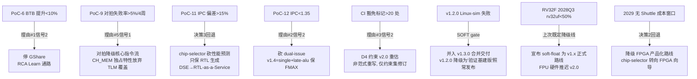

# Reference 4：14 PoC 详细规范 + PoC↔change 映射 + 8 风险反向决策树（2026-09-29 扩展：新增 PoC-13 占位 + PoC-14 + PoC-15）

> **主控文档**：[`../execution-roadmap.md`](../execution-roadmap.md) §3.3 PoC 速查 + §3.4 风险速查
> **关联**：本文是 §3.3 / §3.4 的展开版

---

## 1. 14 个 PoC 详细规范 + OpenSpec change 映射（2026-09-29 扩展：新增 PoC-13 占位 + PoC-14 + PoC-15）

每个 PoC 配**绝对值成功标准**（不能写"快"或"通过"，要写具体数）+ **ADR 锚点** + **OpenSpec change**（已存在/待创建）+ **失败 → 砍分叉**。

| PoC | 内容 | ADR 锚点 | OpenSpec change | 绝对值成功标准 | 失败 → 砍分叉 |
|---|---|---|---|---|---|
| **PoC-1** | MUL/DIV 真多周期 | 046, 047, 082 | `cpu-pipeline-multi-cycle`（P1#5）| MUL=1 cycle、DIV=33 cycle（迭代式）、riscv-tests rv32um **8/8 PASS（100%）**、stall 期间 IPC 回归 ≤5% | DIV>40 cycle → 换 radix-4 SRT（+2 周）；仍不达标 → M 扩展软乘除库兜底，HW M 推迟 v1.0.0 |
| **PoC-2** | RV32C 解码 | 070, 082 | **待创建** `cpu-pipeline-rv32c-decode`（v0.10.0）| rv32uc **≥95% PASS**、misaligned 跨页 fetch 功能正确（专项 ≥20 断言）、代码大小收益实测 ≥25%（CoreMark 编译对比） | 跨页路径 bug 率 >3 个/sprint → 禁跨页 16-bit fetch（保守路径，性能 -3~5% 可接受） |
| **PoC-3** | ICache + fence.i | 071, 072 | **待创建** `cache-icache-fence-i`（v0.10.0）| rv32ui+uc 回归 **100% 无衰退**、I$ 命中率（CoreMark）≥90%、fence.i 后第一条取指必正确（专项断言 ≥10）、FMAX 不降 >5% | I$ 与 PTW 交互死锁复现 >2 次 → fence.i 全冲刷 + I$ 降级 2KB |
| **PoC-4** | S/U + trap 委托 | 073 | **待创建** `cpu-pipeline-smode-umode`（v1.0.0）| trap 优先级真值表 **全 64 组合测试 PASS**、rv32si **100%**、medeleg 委托路径专项 ≥30 断言 | 委托嵌套 bug 无法收敛 → medeleg/mideleg 硬件置零（M-mode 独揽，Linux 仍可跑但性能税 5–10%） |
| **PoC-5** | AMO/LR/SC | 074 | **待创建** `cpu-pipeline-amo-lrsc`（v1.0.0）| rv32ua **100%**、AMO 与 D$ refill 竞态压力测试 10M 事务零错、LR/SC reservation 粒度 = cache line | 竞态 RCA >2 周 → AMO 期间停 refill（保守，store 带宽 -15%） |
| **PoC-6** | BTB→GShare | 075 + 第 11 条 CI | **待创建** `cpu-pipeline-bp-btb-gshare`（v1.0.0）| BTB-only: CoreMark/MHz **≥1.9**（相对 static ≥+20%）；+GShare+RAS: **≥2.3**；mispredict 率 ≤8%（CoreMark 分支流）；fetch 族 Port 直引 ≤2 条 | BTB 提升 <10% → **理由 #1 信号 2 触发**，停堆 GShare，先修 Learn 通路；fetch 族直引 >6 条 → 重做 Port 抽象 |
| **PoC-7** | FreeRTOS demo | 073, 074 | **待创建** `soc-freertos-demo`（v1.0.0）| 3 任务抢占调度 sim 运行 **10M cycle 零异常**、上下文切换延迟 ≤200 cycle、mtimer+PLIC 中断路径 ≥15 断言 | 中断嵌套丢中断 → PLIC 降级为 CLINT-only + 轮询（demo 可跑，产品不可） |
| **PoC-8** | 4-way + PMP + ASID hook | 076, 077 | `cache-phase1.5-4way`（占位，wave3 archive 后展开）+ `phase-1.5-wave-4`（占位）| 4-way RRIP 相对 direct-mapped D$ miss 率降 ≥30%（dhrystone+coremark 混合）；PMP 8 表项越界/合规双向断言 ≥40；ASID=0 全局冲刷语义等价证明 | 4-way 面积 >1.6x 2-way → 默认配置锁 2-way，4-way 纯 DSE 参数 |
| **PoC-9** | Spike lockstep + 双模对拍 | 080 | **待创建** `verification-spike-lockstep`（v1.2.0）| 随机指令流 **1M 条零分歧**（rv32imac）；TLM≡CH_MEM 事务级对拍 **100% match**（固定种子 ≥50 条 trace）；bug 在 TLM 层发现占比 **≥70%**（统计 1 个 sprint） | 对拍失败率连续 4 周 >5% → **理由 #5 信号 1**：对拍降级核心指令流；Spike 分歧率 >0.1% → TLM 降性能模型 |
| **PoC-10** | gdbstub Debug | 078 | **待创建** `soc-debug-gdbstub`（v1.2.0）| halt/resume/step/断点 4 原语功能 PASS、GDB 附载到 Verilator sim 成功单步 ≥1000 指令零错 | halt 侵入导致流水线回归 >2% IPC → 仅留内存断点模式，硬件单步推迟 |
| **PoC-11** | chip-selector | 079, 080 | **待创建** `tools-chip-selector`（v1.3.0）| **8 种配置 TLM 全扫描 <10 分钟**（单机）；Top-3 CH_MEM elaborate+Verilog emit **<1 小时**；每配置报告含 IPC/miss 率/stall 分布；双模对拍 100% match 为出报告前置；**TLM↔CH_MEM IPC 偏差 ≤15%** | TLM 估算与 CH_MEM 实测 IPC 偏差 >15% → 工具降级为"只出 RTL 不出性能预测"（保流片价值，丢 DSE 卖点 —— **决策 3 回退条件触发**） |
| **PoC-12** | dual-issue 7stage 预研 | 081 | **待创建** `cpu-pipeline-dual-issue`（v1.4.0 候选）| single baseline IPC=1.0 归一；dual 实测 **IPC≥1.55**、FMAX **>120 MHz Artix-7**、LUT ≤1.8x；绕过 at_stage 的裸指针点 **≤8 处** | IPC<1.35 或裸指针 >8 处 → **理由 #2 信号 1/2 触发**：砍 dual-issue，v1.4 转向 single+late-alu 保 FMAX |
| **PoC-13** | _（保留 ID，未指派，备选）_ | — | — | — | — |
| **PoC-14** 🆕 | **VexiiRiscv single-issue 对拍（HARD）** | **090**（拟新增） + 040 + 080 | **已创建** [`vexii-riscv-parity-poc`](../../../../../openspec/changes/vexii-riscv-parity-poc/)（proposal 4/4 完成）| **FPGA 实测 CoreMark/MHz 与 VexiiRiscv single-issue 官方 2.4–2.6 偏差 ≤10%（v1.0.0 archive gate）**；v1.3.0 archive 复测 PASS（FPGA 综合版）；TLM↔CH_MEM 双模式偏差 < 5%；baseline.json SHA256 校验通过；VexiiRiscv 2025-07-01 数值 SSOT 化 | 偏差 > 10% 持续 4 周 → 推迟 v1.0.0 + RCA 单项；CoreMark v1.01 ELF license 不可获取 → 降级 Dhrystone 对拍，阈值放宽 15%；baseline.json checksum 不匹配 → CI 阻塞（拒绝执行） |
| **PoC-15** 🆕 | **VexiiRiscv dual 全家桶对拍（HARD 候选）** | **090**（拟新增） + 040 + 080 + 083 | **已创建** [`vexii-riscv-parity-poc`](../../../../../openspec/changes/vexii-riscv-parity-poc/)（proposal 4/4 完成）| **dual 全家桶（dual-issue + HW prefetch + write-back + store buffer）CoreMark/MHz ≥ 4.5**（[估]），**与 VexiiRiscv dual+prefetch 官方 5.24 偏差 ≤15%（v1.4+ archive gate）**；mispredict 率 ~3-5%；DMIPS/MHz ≥ 2.4（追平 VexiiRiscv 2.50 的 96%）；PoC-15 标 `[v1.4-pending]` 在 v1.4 启动前 SKIP | 偏差 > 15% 持续 8 周 → 砍 dual-issue 分叉（理由 #2 信号 2），v1.4 转 single+late-alu；dual 全家桶永不实装 → PoC-15 标 archived-skipped（**不阻塞 PoC-14**）；FPGA 不可综合 → 走 sim-only，FPGA 综合推迟 v1.4+ |

**前置依赖（不在 14 PoC 内但 v0.10.0 启动必须先收官）**：

| 项 | 内容 | OpenSpec change |
|---|------|----------------|
| **P1#4 收官** | plugin-framework-cycle-precision 25/25（PoC-1/2/3 cycle 精度前提） | `plugin-framework-cycle-precision`（P1#4）|
| **回归修复** | `[cpu-l1-mmu-demo]` 6/6 PASS（commit `8a14402` PADDR 改造同步） | （无对应 change，需在 PoC-1 启动前单跑修复）|

---

## 2. **诚实标注 — PoC-11 是单点风险**

> PoC-11 的"TLM 估算 vs CH_MEM 实测 IPC 偏差"是整条商业化路线的**单点依赖**。ChipForge 当前**没有实测数据** —— 双模对拍只验证功能等价，未验证性能模型保真度。
>
> **建议**：v1.0.0 期间插入一个 **0.5 人月的性能保真度预研**（非 PoC，纯测量）。若偏差 >15%，**提前两年**触发 R3 砍 DSE 卖点（决策 3 回退），而不是等到 v1.3.0 才发现。
>
> **这是整个路径图里唯一的"未验证假设"**，其它都有在册机制件兜底。

---

## 3. 8 项关键风险反向决策树

**触发后的具体动作**：

| 风险 | 触发条件 | 砍分叉动作 |
|------|----------|------------|
| **R1** PoC-6 BTB 不足 | BTB CoreMark 提升 < 10% | 停 GShare，启动 Learn 通路 RCA（双 sprint），期间 bp_mode 锁 static |
| **R2** PoC-9 对拍失败 | 连续 4 周失败率 > 5% | 对拍降级核心指令流（ALU/LSU/Branch），CH_MEM 独占特性放弃 TLM 覆盖 |
| **R3** PoC-11 偏差 | TLM vs CH_MEM IPC 偏差 > 15% | chip-selector 砍性能预测，只保 RTL 生成；商业化定位从 DSE-as-a-Service 退到 RTL-as-a-Service |
| **R4** PoC-12 dual-issue | IPC < 1.35 或裸指针 > 8 处 | 砍 dual-issue，v1.4 改 single + late-alu 保 FMAX 路线 |
| **R5** CI 豁免爆发 | `CF_PLUGIN_USE_FSM_EXEMPT` + waiver 标记 > 20 处 | D4 约束集 v2.0 重估（不重写范式，只修订约束），重估期限 6 个月，期间冻结新豁免申请 |
| **R6** v1.2.0 Linux-sim 失败 | Linux sim 启动 6 个月内未到 shell | v1.2.0 降级为"验证基建版"（含 lockstep + 对拍 + gdbstub）发布，Linux-sim 并入 v1.3.0 合并交付 |
| **R7** RV32F 不足 | 2028 Q3 rv32uf 通过率 < 50% | 宣布 soft-float 为 v1.x 正式路线，HW FPU 推迟 v2.0（≥ 2030），CHANGELOG 标注 |
| **R8** Shuttle 错过 | 2029 年无 ASIC Shuttle 成本窗口 | 降级为"FPGA 产品化"路线，chip-selector 工具转向 FPGA 向导（commercial license 改为 FPGA board bundle 销售） |