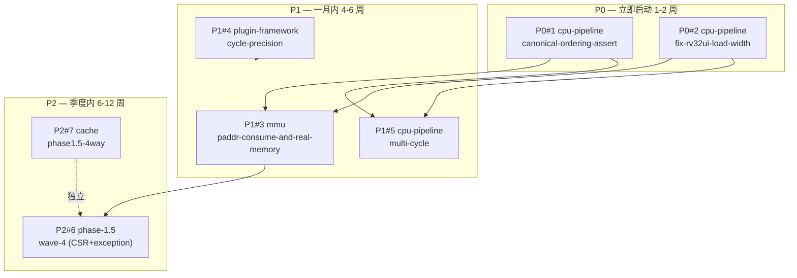

# Strategy: A+C Hybrid — Phase 1.5 收敛 → 产品化前置

> **Status**: ✅ Approved (2026-09-24, v1.1 Oracle/Metis 双审查修订 2026-09-24)
> **决策依据**: Oracle 咨询结论 2026-09-24 + 7 项决策矩阵全 confirm + Metis 预规划审查 v1.0 (10 项修订已应用)
> **目标版本**: ChipForge v0.7.0 → v0.8.0 → v0.9.0 (按 initiative 顺序归档, **Phase 6d 占用 v0.4.0/v0.5.0/v0.6.0 已消费, Phase 1.5 从 v0.7.0 起**)
> **OpenSpec 上下文存储**: `~/.local/share/openspec/context-stores/chipforge/initiatives/`

## 1. 战略选择

**A (Productization) + C (Debt-Clear to RV32I 90%) 混合**, 先清债后 Phase 2。

| 战略 | 内容 | 选? | 理由 |
|------|------|-----|------|
| A. 产品化优先 | Phase 2 → 3 → 4 端到端 | ❌ 否决 | 当前 17 个 TLM pre-existing fail 与 4 个 Wave 2 hidden bug 同根, 不清债会重复踩坑 |
| B. 工具化优先 | Phase 6a → 6b | ❌ 否决 | CH_MEM elaboration 刚收官 (v0.3.0/v0.3.1), 过早切工具化会冲销 6c 成果 |
| **C + A 混合** | Wave 3 → 4 清债 → Phase 2 | ✅ **采纳** | 清债到 RV32I 90% 后再切产品化, 既消除技术债又保留项目立项目标 |

## 2. 7 项决策矩阵 (已确认)

| # | 决策点 | 决策 |
|---|--------|------|
| 1 | Initiative 分组 = B (3 wave-based) | ✅ Yes |
| 2 | P1#4 cycle-precision 并入 wave2 而非独立 | ✅ Yes |
| 3 | 战略表 + `sync_strategy_status.sh` 派生脚本 | ✅ Yes |
| 4 | Initiative 落在 `~/.local/share/openspec/context-stores/chipforge` (CLI 强制 XDG, 非 repo 内) | ✅ Yes (与原方案偏离)|
| 5 | AC 1:1 映射 tasks.md section | ✅ Yes |
| 6 | wave4 initiative 现在建占位 | ✅ Yes |
| 7 | 版本号 v0.7.0/0.8.0/0.9.0 绑 initiative archive (Phase 6d 已消费 v0.4.0/0.5.0/0.6.0, 序号跳号) | ✅ Yes |

## 3. Initiative 清单

| Initiative ID | Title | 包含 Change | 版本节点 | Status |
|---------------|-------|-------------|----------|--------|
| `wave3-cpu-pipeline-debt` | Wave 3 CPU Pipeline 清债 | P0#1 canonical-ordering-assert + P0#2 rv32ui LOAD-width (回顾性 v0.6.0) | **v0.7.0** | 已收官（archived, commit cba5e53 + 8909165 + d98a9dd） |
| `wave3-mmu-real-memory-and-cycle` | Wave 3 MMU 实内存 + 周期精度 | P1#3 mmu-paddr-consume + P1#4 cycle-precision + P1#5 multi-cycle | **v0.8.0** | exploring |
| `wave4-csr-cache-dse` | Wave 4 CSR/异常 + Cache DSE | P2#6 phase-1.5-wave-4 + P2#7 cache 64×4 LRU | **v0.9.0** | exploring (占位) |

## 4. 依赖图

## 5. 战略柱映射

| 柱 | 覆盖 Change | Initiative |
|----|-------------|------------|
| Debt-Clear (A前) | P0#1, P0#2 | `wave3-cpu-pipeline-debt` |
| End-to-End Real | P1#3, P1#4, P1#5 | `wave3-mmu-real-memory-and-cycle` |
| Phase 2 前置 | P2#6, P2#7 | `wave4-csr-cache-dse` |

## 6. 版本节点

| 版本 | 触发条件 | 预期日期 |
|------|----------|----------|
| **v0.7.0** | `wave3-cpu-pipeline-debt` archive | 2026-10 下旬 (2-3 周, P0#1 only — P0#2 回顾性) |
| **v0.8.0** | `wave3-mmu-real-memory-and-cycle` archive | 2026-12 中旬 (依赖 v0.7.0 + 5-7 周, 3 change 串行) |
| **v0.9.0** | `wave4-csr-cache-dse` archive | 2027-02 下旬 (依赖 v0.8.0 + 6-10 周, 含 umbrella 拆分 + cache 4-way) |

## 7. 状态总表 (SSOT)

> ⚠️ **本表**由 `tools/sync_strategy_status.sh` 从 `openspec initiative show <id> --store chipforge` 输出**派生再写入**, 禁止手改。
> 文档维护人员: 任何时候修改本表前必须先运行 `bash tools/sync_strategy_status.sh`。

<!-- AUTO-GENERATED by tools/sync_strategy_status.sh — do not edit -->

| Change | Initiative | Priority | Status | Tasks |
|--------|-----------|----------|--------|-------|
| `2026-09-24-cpu-pipeline-canonical-ordering-assert` | wave3-cpu-pipeline-debt | P0 | ✅ IN_PROGRESS (22/23) (archived) | 1 22 |
| `2026-09-24-cpu-pipeline-fix-rv32ui-load-width` | wave3-cpu-pipeline-debt | P0 | ✅ DONE (archived) | 0 18 |
| `cpu-pipeline-multi-cycle` | wave3-mmu-real-memory-and-cycle | P1 | TODO | 27 0 |
| `mmu-paddr-consume-and-real-memory` | wave3-mmu-real-memory-and-cycle | P1 | TODO | 31 0 |
| `plugin-framework-cycle-precision` | wave3-mmu-real-memory-and-cycle | P1 | TODO | 19 0 |
| `cache-phase1.5-4way` | wave4-csr-cache-dse | P2 | TODO | 32 0 |
| `phase-1.5-wave-4` | wave4-csr-cache-dse | P2 | TODO | 41 0 |

> **Status 解读**:
> - `TODO`: tasks.md 全部 open 或不存在
> - `IN_PROGRESS (N/M)`: 部分完成
> - `DONE`: tasks.md 全部 checked
> - `✅ DONE (archived)`: 已 archive 到 `openspec/changes/archive/`
<!-- end AUTO-GENERATED -->

## 8. 风险 (Oracle/Metis 双审查共识)

| 风险 | 缓解 |
|------|------|
| 战略表手维护漂移 | 强制脚本派生, 文档标 "do not edit" |
| Initiative schema 太薄 | 仅存 id/title/summary, 详情靠 markdown, CI grep + 人审兜底 |
| P2 占位腐化 | P1 执行期同步修订 wave4 placeholder |
| Mega 耦合 (A 方案) | 已规避 (B 方案) |
| 柱分组虚假同柱 (C 方案) | 已规避 (B 方案) |
| P0#1 跨 TU 静态计数器 BUG (Metis #1 CRITICAL) | D1=A 改用 `inline int` (C++17 inline variable), 已在 proposal §R1 标注 |
| sync_strategy_status.sh 数据丢失 (Metis #5 CRITICAL) | 加备份 `.bak` + marker 完整性验证 + awk 子串匹配 (容忍空格差异), 已实装 |

## 9. 已知缺漏 (双审查共识, 不在本战略范围)

| # | 缺漏 | 影响 | 处理 |
|---|------|------|------|
| **L1** | `7stage_add_elf_end_to_end` superscalar cpu_sim segfault (v0.2.2 起 pre-existing) | M5-DSE superscalar 路径阻塞, 但 wave3-4 范围仅 5-stage | 推迟 Phase 5+ (`cpu-superscalar-segfault-investigation` 独立 change) |
| **L2** | `ip/cpu` 老 IP 不遵守标准 IP 文档结构 (无 `ip/cpu/docs/` 等) | 文档债务累积 | 推迟 wave4 完成后 cleanup change (1 天) |
| **L3** | TLM deprecation 路径不清晰 (ADR-040 v3.0 §1260 已标 `pb.run()` deprecated, 但 wave3 全基于 TLM) | 用户预期混乱 | 战略级澄清: TLM 与 CH_MEM 并存**至少到 v1.0.0**, CH_MEM 是 Phase 6d+ 主路径, TLM 是兼容基线 |
| **L4** | MUL/DIV riscv-tests ELF 完全缺失 (Metis #4) | P1#5 测试基线缺 | wave3 P1#5 启动前 vendor `tests/cpu/riscv_tests/build_rv32m.sh` |
| **L5** | rv32mi-p (CSR/trap) ELF 是否已 vendor 未验证 | P2#6 测试基线缺 | wave4 P2#6 启动前 vendor `tests/cpu/riscv_tests/build_rv32mi.sh` |
| **L6** | 17 pre-existing TLM fail 根因未分析 (commit `7d310c6` 之后稳定但 17 个 fail 来源不明) | Phase 1.5 退出标准 "RV32I ≥85%" 验收有歧义 | wave3 (2026-09-26) 加 root-cause triage change (不阻塞本战略启动) |

## 10. Go/No-Go 决策点 (Metis Hidden Intentions 修订)

> **关键认识**: 战略启动后, 每个版本节点触发 Go/No-Go 决策, 中止条件明确, 不隐性吞噬时间盒。

| 节点 | Go 条件 | No-Go 动作 |
|------|--------|----------|
| v0.7.0 archive | P0#1 canonical-ordering PASS + 0 新 fail | 暂停, 修复 P0#1 后重试 |
| v0.8.0 中间检查 | P1#3 PADDR 真消费 + cycle-precision 实装 + multi-cycle stall 注 | **如果评估显示剩余 debt 超预期**: 中止 Phase 1.5, 直接切 Phase 2 (riscv-tests RV64GC) |
| v0.9.0 archive | Phase 1.5 毕业标准达成 (RV32I ≥85%, SoC demo ≥5 ELF tohost=1, cache-dse-sweep CSV, D4+ADR-040+ADR-044+ADR-045 全合规) | 推迟 1 个 wave, 回填 Open Questions, 重审 |
