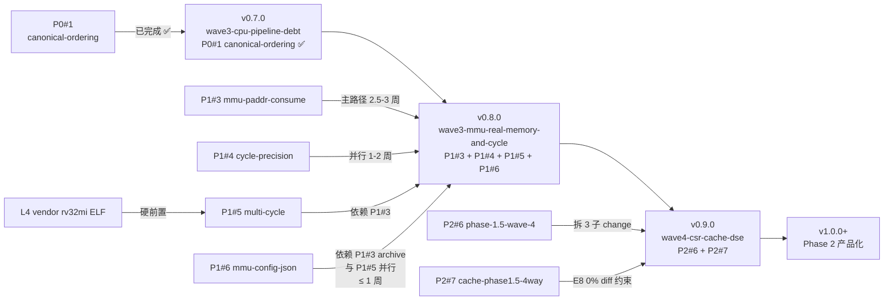

# Execution Roadmap — A+C Hybrid 战略执行分解

> **Status**: 🚧 Active (2026-09-24 起, v0.7.0 archive 后启动)
> **Owner**: ChipForge Build Team
> **关联战略**: [`a-plus-c-hybrid.md`](./a-plus-c-hybrid.md) (§1-§10 决策矩阵 + §6 版本节点 + §10 Go/No-Go)
> **关联 SSOT**: [`a-plus-c-hybrid.md §7`](./a-plus-c-hybrid.md#7-状态总表-ssot) (AUTO-GENERATED, 不可手改)
> **本文档定位**: 战略的**执行分解**——阶段拆解 + 依赖图 + 并行轨道 + 阻塞识别 + Go/No-Go 触发条件
> **与战略文档关系**: 战略 = 为什么做/做什么 (稳定); 执行路线 = 怎么做/谁先谁后/谁并行 (动态)

---

## 0. 依赖图与版本节点速览

> 完整决策矩阵见 `a-plus-c-hybrid.md §6` 版本节点 + §10 Go/No-Go

**当前状态 (2026-09-25)**:
- ✅ v0.7.0 已 archive (3 commits: b2d7c21 + cba5e53 + d98a9dd + 1973cbe)
- ⏸ v0.8.0 待启动 (3 changes 全 TODO, 0/41/19/25 tasks)
- 📋 v0.8.0 拆分新增 P1#6 `mmu-config-json-driven` (proposal 骨架已建, P1#3 archive 后启动)
- ⏸ v0.9.0 待 v0.8.0 archive

---

## 1. Phase 0 — 清理（前置 10 分钟，1 commit）

**目的**: 消除已发现的文档偏差，让 §7 + AGENTS.md 与真实测试状态一致

| # | 任务 | 文件 | 工作量 | 阻塞 |
|---|------|------|--------|------|
| 0.1 | 修正 `a-plus-c-hybrid.md §9 L1` (7stage segfault 已过时，实测 PASS) | `docs/roadmap/strategy/a-plus-c-hybrid.md` | 2 min | — |
| 0.2 | AGENTS.md "已知测试状态" 同步 (riscv-tests 40/40, 7stage PASS 替代 pre-existing fail 记录, CH_MEM 需 >300s) | `AGENTS.md` | 5 min | — |
| 0.3 | `bash tools/sync_strategy_status.sh --dry-run` 验证 §7 稳态 | shell | 1 min | — |
| 0.4 | `git push origin main` (4 commits 未 push) | shell | 2 min | — |

**产出**: 工作树干净 + origin/main 同步 + 文档真实反映当前基线

---

## 2. Phase 1 — Wave 3 启动（v0.8.0 路径）

战略 §6: v0.7.0 archive ✅ → 启动 v0.8.0 的 3 个 changes + L4 vendor

### 2.1 启动 L4 vendor (MUL/DIV ELF, 1-2 天, 独立 change)

**目的**: 消除战略 §9 L4 缺漏，为 P1#5 多周期测试基线提供 ELF

| 任务 | 范围 |
|------|------|
| `tests/cpu/riscv_tests/build_rv32um.sh` | vendor 脚本 (~30 行) |
| ~10 个 ELF 文件 | **rv32um-p-{mul, mulh, mulhu, mulhsu, div, divu, rem, remu, ...}** (M 扩展测试) |
| 1 个新 test | `[riscv-tests-m]` family, **验收 = ELF 可加载执行** (tohost=1 是 P1#5 实装 M 扩展后的验收) |
| 命名澄清 | riscv-tests 前缀: rv32ui=user-int, rv32um=**M 扩展** (本任务), rv32mi=machine-mode CSR/trap (P2#6 前置), rv32ua=atomics, rv32uc=compressed |

**依赖**: riscv64-unknown-elf-gcc (v0.7.0 已具备)

**验收标准** (Oracle Q2): "ELF 可加载 + 可执行到预期 fail 点" (mulh/mul 等尚未实装 → tohost=1 必 fail), 真正的 tohost=1 验收归 P1#5 multi-cycle 实装后

### 2.2 启动 P1#4 `plugin-framework-cycle-precision` (1-2 周, 独立)

**目的**: cycle-accurate 精度基线 — 解锁 P1#5 的 latency_table 框架

| 项 | 内容 |
|----|------|
| **依赖** | ✅ 无 |
| **范围** | ADR-050 引用 v0.6.0 ADR-047 §保留 throw 条款; pb.run() 签名保持 void; cycle_precision framework 不侵入 TLM 热路径 |
| **产出** | cycle_counter + Pipeline 周期级接口 + 5-7 个新测试 |
| **风险** | R1 ADR-050 引用 ADR-047 错误 — 必须 read context 引用最新版本 |

**并行启动轨道**: 与 2.1 + 2.3 同时进行

### 2.3 启动 P1#3 `mmu-paddr-consume-and-real-memory` (2.5-3 周, 主路径)

**目的**: 修真端到端 PADDR 真消费 + cycle-accurate SoC 端到端

| 项 | 内容 |
|----|------|
| **依赖** | ✅ P0#1 canonical-ordering 已 archive (P1#3 proposal depends_on) |
| **范围** | MemoryInterface 抽象 + PTW 真内存 walk + IBus/DBus 真消费 PADDR + ADR-049 + SoC JSON `mmu.memory_interface` 字段。~~TLB 几何/SvMode 从 `ip/mmu/configs/params_schema.json` 读~~ **已拆分到 P1#6 `mmu-config-json-driven` (见 §2.5)** |
| **产出** | ~700 LOC + 3 测试 + ADR-049 + SoC schema 更新 (`mmu.memory_interface`) + `docs/roadmap/dse/mmu-paddr-propagation-matrix.csv` |
| **风险** | R3 ABI 改需 pb.run() 验证 (兜底: `tests/cpu/test_cpu_real_tohost` 5 ELF); R4 PADDR 字段类型变更需所有 Plugin 同步 |
| **估时** | Oracle 估时 ~2 周, Metis 实测偏差 +0.5-1 周 (跨 5 文件 ABI); 拆分 P1#6 后回归 Oracle 估时 ≤ 2 周 |

**并行启动轨道**: 与 2.1 + 2.2 同时进行

### 2.4 启动 P1#5 `cpu-pipeline-multi-cycle` (2-3 周, 依赖 P1#3)

**目的**: MUL/DIV 多周期子流水 + 多 Plugin latency_table 框架

| 项 | 内容 |
|----|------|
| **依赖** | P1#3 完成 (latency_table 多 Plugin 裁决需要 P1#3 的接口稳定) + L4 vendor (2.1) |
| **范围** | MUL/DIV 多周期子流水 (mul_latency=1/3/5) + latency_table 框架 (框架层取**最大值**, 保守 stall) + 5 ELF baseline 对比 |
| **产出** | RiscvMulPlugin<U, LATENCY> 多模板实装 + latency_table header + 5 ELF cycle-identical 验证 |

### 2.5 启动 P1#6 `mmu-config-json-driven` (≤ 1 周, P1#3 archive 后启动, 与 P1#5 并行)

> **Scope 拆分来源**: 本 change 由 P1#3 拆分, 详见 ADR-048 §后续项修订 + 本文档 §2.3 修订标注。理由:
> 1. 避免 P1#3 scope creep (Oracle 估时 ~2 周 + JSON 化 +0.5-1 周);
> 2. 时序上 P1#3 铺好 `MMUPlugin` 构造参数 (`MMUConfig`) 注入点是 JSON 化的天然落点;
> 3. 与 P1#5 (`cpu-pipeline-multi-cycle`) 并行可行 (互不阻塞, 双方均依赖 P1#3 完成)。

**目的**: MMU 配置 JSON 化 —— `MMUPlugin` 构造参数从 `ip/mmu/configs/params_schema.json` 反序列化, 消除 `CpuFactory::register_early_plugins()` (`ip/cpu/cpu_factory.h:369-396`) 中 TLB 几何硬编码

| 项 | 内容 |
|----|------|
| **依赖** | P1#3 archive (注入点稳定) |
| **范围** | `MMUPlugin` / `RiscvMMUPlugin` 构造函数接 JSON config + `params_schema.json` 既有字段复用 (无新词) + `register_early_plugins()` 硬编码消除 + SoC JSON `mmu.levels` / `mmu.ptw_max_inflight` 字段 (与 `MMUPlugin::TLBConfig` 1:1, sv_mode 单源在 `cpu_default.json::mmu_mode` 不重复声明) + 3-5 个 `[mmu-config-json]` 测试 |
| **产出** | `ip/mmu/lib/mmu_config_loader.{h,cpp}` (~150 LOC, lib/ 层允许 nlohmann/json 依赖) + `ip/cpu/plugins/mmu.h` 接口同步 + `tests/mmu/test_mmu_json_config.cpp` (~100 LOC) |
| **风险** | R1 P1#3 archive 后 `mmu.levels`/`mmu.ptw_max_inflight` 与 P1#3 `mmu.memory_interface` 节点命名协调 (字段命名已与既有 `params_schema.json` 词汇表对齐); R2 fallback 硬编码路径与 P1#3 改后 `MMUConfig` 默认值一致性; R3 多 SoC JSON 缺失字段处理策略 (warning log 单条聚合, 不刷屏) |
| **估时** | ≤ 1 周 (Oracle 估时: 配置层单 module 改动, 无 ABI 跨 5 文件) |
| **兼容** | TLM baseline (JSON 缺失字段 fallback 硬编码 → byte-equal); CH_MEM (build 期一次, 无 elaboration 感知); ADR-040 v2.0 §3 实现样本 |
| **proposal** | `openspec/changes/mmu-config-json-driven/proposal.md` (骨架, design/tasks 待 P1#3 archive 后细化) |

**并行启动轨道**: 与 §2.4 P1#5 同时进行 (P1#5 改 latency_table 框架, P1#6 改 MMU 配置层, 双方均在 P1#3 完成基础上展开, 互不阻塞)

---

## 3. Go/No-Go 决策点（战略 §10）

### 3.1 v0.8.0 中间检查 (P1#3/P1#4/P1#5 全 archive 后)

> **量化标准 (Oracle 2026-09-25 修订)** — 全部满足 = Go, 任一违反 = 触发 §10 切轨评估

| # | 指标 | Go 阈值 | No-Go 信号 |
|---|------|---------|-----------|
| 1 | **日程** | v0.8.0 启动到 3 change 全 archive ≤ 6 周 | P1#3 单独 elapsed > 4 周 (Metis 偏差上限 1 周再 +1 周缓冲) |
| 2 | **功能-PADDR 真消费** | `[cpu-l1-mmu-demo]` ≥ 8/8, 其中 ≥ 2 个新 PADDR 传播用例 PASS | 新用例靠 `paddr_valid=false` fallback 蒙混通过 (需检查断言走真 PADDR 分支) |
| 3 | **功能-多周期 cycle-identical** | ≥ 3/5 MUL/DIV ELF 0% diff (允许 ≤ 2 个"已记录分歧" + CSV 说明) | 0/5 identical 或分歧无根因分析 |
| 4 | **回归** | riscv-tests ≥ 40/40, TLM 0 新 fail, 3 门禁 (verify_adr + verify_plugin_decision + check_plugin_portability) 全 PASS (每个 archive 点) | 任一 archive 点门禁不过仍强行 archive |
| 5 | **重试** | 每 change verifier 重试 ≤ 2 轮 | 任一 change 第 3 轮仍 fail → 直接判 No-Go, 不继续烧时间 |

**L6 (17 pre-existing TLM fail 根因)** 不进 v0.8.0 验收 — 当前实测 0 fail, 根因分析作为 Phase 2 入场债记录即可

### 3.2 v0.9.0 archive (Phase 1.5 毕业标准)

| Go 条件 | No-Go 后果 |
|--------|----------|
| ✅ RV32I ≥85% riscv-tests PASS ✅ SoC demo ≥5 ELF tohost=1 ✅ cache-dse-sweep CSV 产出 ✅ D4 + ADR-040 + ADR-044 + ADR-045 全合规 | 推迟 1 个 wave, 回填 Open Questions, 重审 |

---

## 4. Phase 2 — Wave 4 启动（v0.8.0 archive 后）

战略 §6: v0.9.0 目标, 依赖 v0.8.0 完成 + 6-10 周

### 4.1 P2#6 `phase-1.5-wave-4` (4-6 周, CSR + exception + mispredict)

| 项 | 内容 |
|----|------|
| **依赖** | v0.8.0 archive + §9 L5 vendor rv32mi-p ELF (CSR/trap 测试基线, 可能与 L4 重叠) |
| **范围** | CSR 最小集 (mstatus/satp/scause/sepc/stvec) + exception 路由 (RiscV spec §1.6) + mispredict recovery |
| **产出** | RiscvCsrPlugin 完整版 + exception 路由 + mispredict squash |

### 4.2 P2#7 `cache-phase1.5-4way` (3-4 周, cycle-identical 5 ELF)

| 项 | 内容 |
|----|------|
| **依赖** | v0.8.0 archive |
| **范围** | L1D 4-way LRU + cycle-identical 5 ELF baseline (**E8 0% diff 约束**, 与 Phase 6d 6d.5 baseline 保持) |
| **产出** | L1CachePlugin 4-way 升级 + TLM+CH_MEM 双轨 + cache-dse-sweep CSV |

---

## 5. 待启动决策点（需用户确认）

| # | 决策 | 推荐 | 替代 |
|---|------|------|------|
| D1 | Phase 0 清理要现在做吗? | ✅ 现在做 (10 min, 1 commit, 修 §9 L1 + AGENTS.md + push) | 推到下次 session |
| D2 | P1#3 vs P1#4 启动优先级 | ✅ P1#3 立即启动 + P1#4 并行 (P1#3 是主路径长任务, P1#4 独立可并行) | P1#4 先做完再 P1#3 |
| D3 | L4 vendor (MUL/DIV ELF) 是否独立成 change? | ✅ 独立成 `vendor-rv32mi-elf` change (1-2 天, 与 P1#5 启动并行) | 内嵌在 P1#5 tasks.md |
| D4 | v0.8.0 中间检查是否触发 Phase 2 切轨? | 默认 Go; 若剩余 debt 超预期按战略 §10 切 Phase 2 | — |
| D5 | git push 是否现在做? | ✅ Phase 0 一起 (4 commits 累积, 减少 push 频率) | 推迟到下次完整阶段 |

---

## 6. 关联文档

- 战略入口: [`a-plus-c-hybrid.md`](./a-plus-c-hybrid.md) (§1-§10)
- 路线图状态: [`../roadmap-status.md`](../roadmap-status.md) (滚动状态简报)
- 6 活跃 changes: `openspec/changes/{cpu-pipeline-multi-cycle,mmu-paddr-consume-and-real-memory,plugin-framework-cycle-precision,cache-phase1.5-4way,phase-1.5-wave-4}/`
- sync 工具: `tools/sync_strategy_status.sh` (§7 AUTO-GENERATED 派生)
- 验证命令: `tools/{verify_adr,verify_plugin_decision,check_plugin_portability,doc_link_check}.sh`

---

## 7. 变更日志

| 日期 | 版本 | 变更 | 作者 |
|------|------|------|------|
| 2026-09-24 | v1.0 | 初稿（v0.7.0 archive 后, v0.8.0 启动前路线分解） | Sisyphus (post Oracle/Metis Phase A review) |