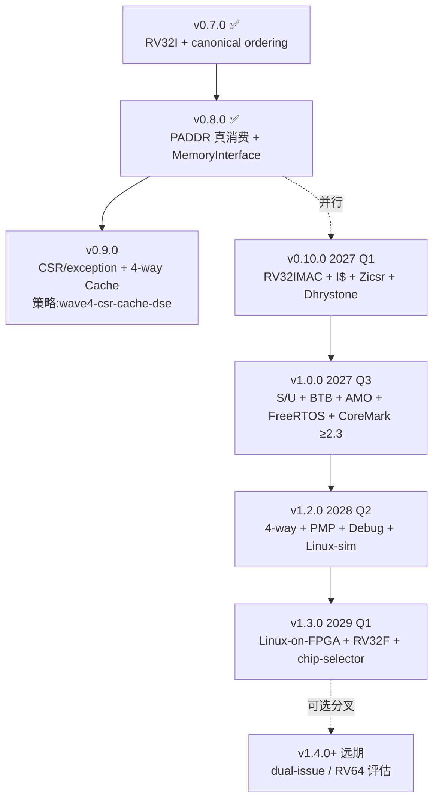

# ChipForge 超越路径规划（v0.10.0 → v1.3.0）

> **文档定位**：本文档是 `soc/cpu/docs/roadmap/` 的**主控执行路线图**。最小骨架，仅含目标、产出、实施路径、CI 同步规则。深度内容（决策机制、ADR 矩阵、多核对比、PoC 详规、风险决策树）拆分到 `references/` 子目录。
>
> **关联**：[`README.md`](./README.md) | [`references/`](./references/) | [`archive/`](./archive/)（历史 phase 文档）
>
> **ADR 编号约定（2026-09-26）**：原规划 ADR-050~062 与 active change 占用的 ADR-050（pb-run-cycle-precision）/ ADR-051（plugin-latency-table）撞号，本文档新规划段平移到 **ADR-070~083（14 条**，含 083=write-back FSM 为净新增；清单 SSOT 见 [`references/adr-matrix.md`](./references/adr-matrix.md)），active change 占用的 052–069 留给 wave3 残余 change（P1#4/P1#6）与 wave4 消化。

---

## 1. 目标（Goals）

| 维度 | 目标 | 验证节点 |
|------|------|---------|
| **技术目标** | v1.3.0 实现 RV32IMAC + S/U mode + 动态 BP + Linux-on-FPGA + chip-selector 工具 | 见 §3 |
| **差异化目标** | 3 大决策锁定（范式不动 / ASIC 友好 / DSE-as-a-Service） | 见 §2 |
| **超越目标** | 在 8 个 🚀 独占维度构成 VexRiscv/VexiiRiscv 差异化超越（双模同语义 / golden 与 RTL 同源 / CI 11 门禁 / TLB RRIP / MemoryInterface 解耦 / 架构探索单源生成 / 定制指令极低侵入度 / **双模对拍协议 ADR-080** —— 2026-09-29 新增 v1.2.0/v1.3.0 双层防护，VexiiRiscv 结构性无法跟进） | 见 [`references/multi-core-comparison.md`](./references/multi-core-comparison.md) §2 |
| **非目标** | 不与 XiangShan 拼 OoO 性能 / 不与 VexiiRiscv 拼配置空间 / 不做 ASIC 物理实现（v1.3.0 前纯 FPGA 验证） | 见 §2 决策 2 |

---

## 2. 3 大决策锁定（2026-09-26）

| # | 决策 | 硬门禁 | 客观回退信号 | 详细论证 |
|---|------|--------|--------------|----------|
| **1** | **不抛弃 Plugin 范式，机制升级** | CI 第 8 条（dynamic_cast=0）+ 第 11 条（fetch 族 Port 强制） | 4 类客观信号 | [`references/decision-1-plugin-evolution.md`](./references/decision-1-plugin-evolution.md) |
| **2** | **ASIC 友好，FPGA 用于验证** | CI 第 10 条（核内禁 `#ifdef FPGA`） | 2029 无 ASIC Shuttle 窗口 → 降 FPGA 产品化路线 | 见 §3.1 |
| **3** | **DSE-as-a-Service 商业化** | ADR-079 chip-selector 契约（v1.3.0） | PoC-11 TLM↔CH_MEM IPC 偏差 >15% → DSE→RTL-as-a-Service | 见 §3.4 |

---

## 3. 实施路径（Execution Path）

### 3.1 4 版本节点 timeline



```
2026Q4    2027Q1      2027Q2      2027Q3      2027Q4      2028Q1      2028Q2      2028Q3      2028Q4      2029Q1
```

> ⚠️ **2026-09-27 修订**：原 ASCII art 列对齐脆弱（C-ext 错位至 2027Q2 列、v1.3.0 偏移至 2028Q4 列），且与 §3.2 交付表不一致（RV32C 是 v0.10.0 交付而非 2027Q2 工作流）。改为下表（季度 × 工作流）。

| 工作流 | 2026 Q4 | 2027 Q1 | 2027 Q2 | 2027 Q3 | 2027 Q4 | 2028 Q1 | 2028 Q2 | 2028 Q3 | 2028 Q4 | 2029 Q1 |
|--------|---------|---------|---------|---------|---------|---------|---------|---------|---------|---------|
| **版本节点** | — | **v0.10.0** | — | **v1.0.0** | — | — | **v1.2.0** | — | — | **v1.3.0** (+v1.4 分叉点) |
| **核心 ISA** | — | RV32IMAC + RV32C + ICache + Zicsr/Zifencei | RV32A + D$ 改造 | S/U + BTB + AMO + PLIC/CLINT | — | — | 4-way + PMP + Debug | — | RV32F soft-float? 内测 | Linux-on-FPGA + chip-selector |
| **生态/工具** | P1#4/5/6 收官 + mfc 启动 | Dhrystone | — | FreeRTOS demo + CoreMark ≥2.3 | GShare | RRIP | gdbstub + lockstep | SOFT ok boot | — | TLM↔CH_MEM IPC ≤15% |
| **里程碑** | wave3-mmu 闭环 + wave5 启动 | rv32ui+um+uc 100% | — | rv32ua+si 100% / FMAX ≥100MHz | — | — | lockstep 1M 零分歧 (HARD) | Linux-sim (SOFT) | — | FPGA CoreMark ≥2.5 |

> **关键修正**：RV32C（C-ext）列于 v0.10.0（2027 Q1）列（§3.2 交付），不再错位至 Q2；v1.3.0 列于 2029 Q1（Mermaid/§3.2 一致），不再偏移。

**Hard prerequisites（v0.10.0 启动必须先收官）**：

| # | 前置项 | 当前状态（2026-09-27 校准） | 验证位置 |
|---|--------|------------------------|---------|
| 1 | ~~`plugin-framework-cycle-precision` P1#4 实装完成（v0.10.0 PoC-1/2/3 的 cycle 精度前提）~~ → **降级为 Phase F optional**（2026-09-29 Step 4 决策 (b)）| 🔴 **0/25 未实装**（2026-09-29 Oracle 审计：代码考古零痕迹 — 无 `CURRENT_CYCLE` / 无 `cycle_count_t` / 无 `test_pb_run_cycle_precision.cpp` / 无 `ADR-050*`；git 历史仅 `b2d7c21` 创建提案）。**非 mfc 启动前置**：mfc `tasks.md:11` 明示"不依赖"、实际消费在 Phase F (tasks.md:178-182)。本行原 SSOT 漂移"代码实装 25/25 收官"为乐观幻觉，已删除。 | `openspec/changes/plugin-framework-cycle-precision/tasks.md` (0/25 honest signal) |
| 2 | `[cpu-l1-mmu-demo]` 6/6 PASS 修回归（commit `8a14402` PADDR 改造同步）| ✅ **v0.10.2 实测 6/6** (v0.10.1 deep-rca workaround `cfg.enable_mmu=false` + v0.10.2 cpu-factory-satp-mapping 落地 infrastructure, 真 sv32 e2e 翻转推迟到 `cpu-pipeline-mmufault-handler`) | ctest `[cpu-l1-mmu-demo]` |
| 3 | `cpu-pipeline-multi-cycle` P1#5 被 wave5 `mfc-cpu-pipeline-multi-cycle-fsm` supersede | 🟡 **部分收官（2026-09-29）**：Phase A (5/59) + Phase B.1 RED + B.2 GREEN + B.2.1 GREEN ch_reg 缓存（8/60 done）。B.2.1 PoC 限制已显式记录（ch 算术 * / 用 `ch_literal<12,3,33>` 占位, 真 ch 算术 fix 跟踪 Phase C.2/B.4；ch_reg lock 顺序 race 跟踪 Phase C.2）。继续 Phase B.3/B.4/C.1-C.6/D.1-D.4/E.1-E.5/F.1-F.3 | `openspec/changes/mfc-cpu-pipeline-multi-cycle-fsm/` |
| 4 | 2 个 wave4 占位 change（cache-phase1.5-4way / phase-1.5-wave-4）展开 | ⏸ 待 wave3-mmu 残余 change（P1#4 checkbox + P1#6）闭环后展开 | OpenSpec tasks.md |

> **删除**：原 §3.1 #4 误将 `mmu-config-json-driven`（P1#6，wave3-mmu 自身）列为 "wave3 archive 后展开" 的占位 change，已修正。P1#6 实际触发条件 = **P1#3 archive**（已于 2026-09-26 达成，commit 8a14402），现已可启动。

### 3.2 4 版本节点产出（Deliverables）

| 版本 | 产出（代码/测试/ADR/CI/文档/Demo） | 关键指标 | **VexiiRiscv 客观对拍 HARD 门禁**（2026-09-29 新增） |
|------|----------------------------------|----------|------------------------------------------------|
| **v0.10.0** (2027 Q1) | MUL/DIV FSM + RV32C + ICache + Zicsr/Zifencei + ADR-082 negotiate | rv32ui+um+uc 100% / DMIPS/MHz ≥1.4 / CI 门禁 9→11 | DMIPS/MHz 与 VexiiRiscv single-issue（官方 ~1.4 [估]）偏差 ≤ 10% [目] |
| **v1.0.0** (2027 Q3) | S/U mode + RV32A + BTB+GShare+RAS + PLIC/CLINT + FreeRTOS demo + ADR-073/074/075 | rv32ua+si 100% / CoreMark ≥2.3 / FMAX ≥100 MHz | **PoC-14（HARD 门禁）**：FPGA CoreMark/MHz 与 VexiiRiscv single-issue（官方 2.4–2.6）偏差 ≤ 10% |
| **v1.2.0** (2028 Q2) | 4-way RRIP + PMP + gdbstub + Spike lockstep + ADR-080 对拍试点 | lockstep 1M 条零分歧（HARD）/ Linux-sim shell（SOFT）| ADR-080 双模对拍协议 HARD 试点（v1.3.0 转硬门禁）|
| **v1.3.0** (2029 Q1) | Linux-on-FPGA + RV32F（或宣告 soft-float）+ chip-selector CLI + ADR-080 转硬门禁 | FPGA CoreMark ≥2.5 / TLM↔CH_MEM IPC 偏差 ≤15% / 8 配置 TLM 扫描 <10min | **PoC-14 复测（HARD 门禁）**：FPGA CoreMark/MHz 与 VexiiRiscv single-issue 偏差 ≤ 10%；**ADR-080 TLM↔CH_MEM byte-equal HARD 门禁** |
| **v1.4+（远期候选分叉）** (2029 Q3+) | dual-issue + HW prefetch + write-back + store buffer 全家桶（ADR-075/081/083）| dual-issue IPC ≥ 1.55 / CoreMark/MHz ≥ 4.5 [估] | **PoC-15（HARD 候选门禁）**：dual 全家桶 CoreMark/MHz ≥ 4.5，且与 VexiiRiscv dual+prefetch（官方 5.24）偏差 ≤ 15% |

> v0.9.0（CSR/exception + 4-way Cache）由 strategy `wave4-csr-cache-dse` 管理（占位 change `cache-phase1.5-4way` + `phase-1.5-wave-4`），本表不展开。

### 3.3 14 个 PoC 速查（2026-09-29 扩展：新增 PoC-14 + PoC-15）

完整规范（含 ADR 锚点 + 失败砍分叉 + PoC↔OpenSpec change 映射）见 [`references/poics-and-risks.md`](./references/poics-and-risks.md)。

| 版本 | 代表性 PoC（其余见 references）|
|------|-------------------------------|
| **v0.10.0** | PoC-1 MUL/DIV 1c/33c rv32um 100% · PoC-2 RV32C ≥95% · PoC-3 ICache 命中 ≥90% |
| **v1.0.0** | PoC-4 S/U trap 64 组合全 PASS · PoC-5 AMO 100% · PoC-6 BTB CoreMark ≥1.9 · PoC-7 FreeRTOS 10M cycle · **PoC-14（2026-09-29 新增 HARD）**：FPGA 实测 CoreMark/MHz 与 VexiiRiscv single-issue（官方 2.4–2.6）偏差 ≤ 10% |
| **v1.2.0** | PoC-8 4-way RRIP miss 率降 ≥30% · PoC-9 Spike lockstep 1M 条零分歧 · PoC-10 gdbstub |
| **v1.3.0** ⚠️ | **PoC-11 chip-selector 单点风险**：8 配置 TLM <10min + TLM↔CH_MEM IPC 偏差 ≤15%（>15% 触发决策 3 回退）· **PoC-14 复测（HARD）**：FPGA CoreMark/MHz 与 VexiiRiscv single-issue 偏差 ≤ 10% + **ADR-080 TLM↔CH_MEM byte-equal HARD 门禁** |
| v1.4+ 候选 | PoC-12 dual-issue IPC ≥1.55 · **PoC-15（2026-09-29 新增 HARD 候选）**：dual 全家桶（dual-issue + HW prefetch + write-back + store buffer）CoreMark/MHz ≥ 4.5，且与 VexiiRiscv dual+prefetch（官方 5.24）偏差 ≤ 15% |

### 3.4 8 项风险速查（2026-09-27 补全全部 8 项，避免 references 跳转）

| 风险 | 触发信号 | 砍分叉 |
|------|---------|--------|
| **R1** PoC-6 BTB 不足 | BTB CoreMark 提升 < 10% | 停 GShare，启动 Learn 通路 RCA（双 sprint），期间 bp_mode 锁 static |
| **R2** PoC-9 对拍失败 | 连续 4 周失败率 > 5% | 对拍降级核心指令流（ALU/LSU/Branch），CH_MEM 独占特性放弃 TLM 覆盖 |
| **R3** ⚠️ PoC-11 偏差 | TLM vs CH_MEM IPC 偏差 > 15% | chip-selector 砍性能预测，只保 RTL 生成；商业化定位从 DSE-as-a-Service 退到 RTL-as-a-Service（**决策 3 回退条件**）|
| **R4** PoC-12 dual-issue | IPC < 1.35 或裸指针 > 8 处 | 砍 dual-issue，v1.4 改 single + late-alu 保 FMAX 路线 |
| **R5** CI 豁免爆发 | `CF_PLUGIN_USE_FSM_EXEMPT` + waiver 标记 > 20 处 | D4 约束集 v2.0 重估（不重写范式），重估期限 6 个月，期间冻结新豁免申请 |
| **R6** v1.2.0 Linux-sim 失败 | Linux sim 启动 6 个月内未到 shell | v1.2.0 降级为"验证基建版"发布，**Linux-sim 并入 v1.3.0 合并交付 = 先 TLM-sim 到 shell 后 FPGA 启动 Linux 同版交付**（非"Linux-on-FPGA 替代"，R6 触发 ≠ v1.3.0 目标变更）|
| **R7** RV32F 不足 | 2028 Q3 rv32uf 通过率 < 50% | 宣布 soft-float 为 v1.x 正式路线，HW FPU 推迟 v2.0（≥2030），CHANGELOG 标注 |
| **R8** Shuttle 错过 | 2029 年无 ASIC Shuttle 成本窗口 | 降级为"FPGA 产品化"路线，chip-selector 转向 FPGA 向导（commercial license → FPGA board bundle）|

**完整反向决策树 + 触发后动作**见 [`references/poics-and-risks.md`](./references/poics-and-risks.md) §3。

### 3.5 架构演进与架构图（v0.10.0 → v1.3.0 四版本节点）

> **目的**: 把 §3.1 timeline + §3.2 deliverables + §3.3 14 PoC + §3.4 8 风险 落到**具体架构图**上,作为 v0.10.0 → v1.3.0 实施的**视觉 SSOT**。
>
> **与现有文档关系**:
> - §3.1-§3.4 = 文本驱动的"做什么"（timeline / 产出 / PoC / 风险）
> - §3.5（本节）= 视觉驱动的"怎么做"（架构图 + 关键决策）
> - 深度 ADR 锚点见 [`references/adr-matrix.md`](./references/adr-matrix.md)

#### 3.5.1 架构演进全景（4 版本节点时间线 + 关键架构能力）

```
┌──────────────────────────────────────────────────────────────────────┐
│  2027 Q1            2027 Q3            2028 Q2            2029 Q1    │
│  ┌────────┐         ┌────────┐         ┌────────┐         ┌────────┐ │
│  │v0.10.0 │ ──────► │ v1.0.0 │ ──────► │ v1.2.0 │ ──────► │ v1.3.0 │ │
│  └────────┘         └────────┘         └────────┘         └────────┘ │
│     │                  │                  │                  │       │
│  ADR-082            ADR-070~076        ADR-080            ADR-079     │
│  negotiate          S/U+AMO+           RRIP+PMP+          chip-       │
│  capability         BTB+PLIC/          Spike              selector    │
│  +MUL/DIV FSM       CLINT              lockstep           商业化      │
│     │                  │                  │                  │       │
│     ▼                  ▼                  ▼                  ▼       │
│  ┌────────┐         ┌────────┐         ┌────────┐         ┌────────┐ │
│  │PoC-1~3 │         │PoC-4~7 │         │PoC-8~10│         │PoC-11  │ │
│  │rv32ui  │         │rv32ua+ │         │4-way+  │         │chip-   │ │
│  │+um+uc  │         │si 100% │         │PMP+    │         │selector│ │
│  │100%    │         │CoreMark│         │Debug   │         │IPC ≤15%│ │
│  └────────┘         │≥2.3    │         │Linux-  │         └────────┘ │
│                     └────────┘         │sim SOFT│                       │
│                                        └────────┘                       │
└──────────────────────────────────────────────────────────────────────┘

通用架构能力栈（4 版本累积）:
├─ Phase 6d (前置): CH_MEM elaboration + Verilog 生成 + Verilator 后端
├─ v0.9.0 (前置): ADR-049 PADDR 真消费 + ADR-046 多周期 FSM 豁免 + 4-way Cache
├─ v0.10.0: ADR-082 negotiate capability + MUL/DIV FSM + RV32C + ICache + Zicsr
├─ v1.0.0: S/U mode + AMO + BTB/GShare/RAS + PLIC/CLINT + FreeRTOS demo
├─ v1.2.0: 4-way RRIP + PMP + Debug + Spike lockstep + gdbstub
└─ v1.3.0: Linux-on-FPGA + chip-selector CLI + ADR-080 双模对拍硬门禁
```

#### 3.5.2 v0.10.0 架构目标（2027 Q1,Wave 5 isa-coverage-and-bp）

**核心**: RV32IMAC + RV32C + ICache + Zicsr/Zifencei + MUL/DIV FSM + ADR-082 negotiate capability

```
┌──────────────────────────────────────────────────────────────────────┐
│  v0.10.0 架构总览                                                     │
├──────────────────────────────────────────────────────────────────────┤
│                                                                       │
│   ┌─────────── Application: rv32ui+um+uc 100% ──────────────────┐    │
│   │  add / addi / auipc / jal / beq + MUL/DIV + RVC 16-bit      │    │
│   └───────────────────────────┬──────────────────────────────────┘    │
│                               │                                       │
│   ┌───────────────────────────▼──────────────────────────────────┐    │
│   │  Plugin 框架扩展: ADR-082 negotiate(CapabilityTable&)        │    │
│   │  ┌──────────────────────────────────────────────────────┐   │    │
│   │  │  pb.build() 编排:                                    │   │    │
│   │  │  1. 注册所有 Plugin                                   │   │    │
│   │  │  2. 拓扑排序 (基于 negotiate 输出的 requires 边)      │   │    │
│   │  │  3. for each Plugin:                                  │   │    │
│   │  │     cap_table = new CapabilityTable                    │   │    │
│   │  │     plugin->negotiate(cap_table) ← NEW 钩子           │   │    │
│   │  │     if plugin->validate() returns err → throw         │   │    │
│   │  │  4. for each Plugin in topo order: build()            │   │    │
│   │  └──────────────────────────────────────────────────────┘   │    │
│   │  CI 第 8 条门禁: build() 内 dynamic_cast = 0                  │    │
│   └──────────────────────────────────────────────────────────────┘    │
│                               │                                       │
│   ┌───────────────────────────▼──────────────────────────────────┐    │
│   │  5-stage Pipeline (CH_MEM 完整, 来自 Phase 6d)              │    │
│   │  IF → ID → EX → MEM → WB                                     │    │
│   │  + IBusPlugin / DBusPlugin (CH_MEM, 来自 Phase 6d)         │    │
│   │  + DecoderPlugin (完整 RV32IMAC 主 opcode 7+funct3+funct7)  │    │
│   │  + IntAluPlugin + BranchPlugin + HazardPlugin (CH_MEM)     │    │
│   │  + RegFilePlugin (32 ch_reg, CH_MEM)                        │    │
│   └──────────────────────────────────────────────────────────────┘    │
│                               │                                       │
│       ┌───────────────────────┼───────────────────────┐               │
│       ▼                       ▼                       ▼               │
│  ┌─────────┐           ┌─────────────┐         ┌─────────────┐         │
│  │MUL/DIV  │           │   ICache    │         │   Zicsr/    │         │
│  │FSM      │           │  (新 PoC-3) │         │  Zifencei   │         │
│  │(PoC-1)  │           │  ≥90% 命中  │         │  CSR 扩展   │         │
│  │         │           └─────────────┘         │  + FENCE.I  │         │
│  │ch_state_│                                  └─────────────┘         │
│  │machine  │           ┌─────────────┐         ┌─────────────┐         │
│  │+ EXEMPT │           │   RV32C     │         │   ADR-070   │         │
│  │         │           │  (新 PoC-2) │         │   2-phase   │         │
│  │requires:│           │  16-bit 压缩│         │   fetch     │         │
│  │- flush_ │           │  ≥95%       │         │             │         │
│  │ broad-  │           └─────────────┘         └─────────────┘         │
│  │ caster  │                                                          │
│  │- write- │           ┌─────────────────────────────┐                │
│  │ back_   │           │  ADR-082 negotiate 实例契约 │                │
│  │ arbiter │           │  MulDivFsmPlugin.negotiate()│                │
│  └─────────┘           │  cap.provide<MCFHandle>(    │                │
│                        │    "multi_cycle_fsm")       │                │
│                        │  cap.require<FlushBroad>(    │                │
│                        │    "flush_broadcaster")     │                │
│                        │  cap.require<WBArbiter>(    │                │
│                        │    "writeback_arbiter")     │                │
│                        │  BranchPlugin.negotiate()   │                │
│                        │  cap.provide<FlushBroad>(    │                │
│                        │    "flush_broadcaster")     │                │
│                        │  HazardPlugin.negotiate()   │                │
│                        │  cap.provide<WBArbiter>(...)│                │
│                        └─────────────────────────────┘                │
│                                                                       │
│   验证: PoC-1 (MUL/DIV 1c/33c rv32um 100%)                           │
│        PoC-2 (RV32C ≥95%)                                            │
│        PoC-3 (ICache 命中 ≥90%)                                      │
└──────────────────────────────────────────────────────────────────────┘
```

**关键架构变更**:

| 维度 | v0.9.0 → v0.10.0 | 关联 ADR |
|------|------------------|---------|
| 框架层 | 无 negotiate → `Plugin::negotiate(CapabilityTable&)` 新增 | ADR-082 |
| MUL/DIV | stub → ch_state_machine FSM (1c/3c/33c) | ADR-046 |
| 指令集 | RV32I → RV32IMAC + RV32C | ADR-070 (RVC) |
| CSR | 基础 → mcycle/minstret/Zicsr/Zifencei | Zicsr ext |
| 缓存 | 无 I$ → ICache 新增 (PoC-3) | ADR-040 v3.0 |
| CI 门禁 | 9 → 11 (新增第 8 条 dynamic_cast + 第 10 条 FPGA ifdef) | 决策 1+2 |
| PoC | 0 → 3 (PoC-1/2/3) | §3.3 |

#### 3.5.3 v1.0.0 架构目标（2027 Q3,wave6-linux-and-productization §1）

**核心**: S/U mode 完整 + RV32A 原子操作 + 分支预测 BTB+GShare+RAS + PLIC/CLINT 中断 + FreeRTOS 验证

```
┌──────────────────────────────────────────────────────────────────────┐
│  v1.0.0 架构总览                                                     │
├──────────────────────────────────────────────────────────────────────┤
│                                                                       │
│   ┌───────────── Application: FreeRTOS demo + CoreMark ≥ 2.3 ────┐  │
│   │  Multi-task scheduling + Timer interrupt + Semaphore/Queue    │  │
│   │  + RV32A atomic + S-mode trap 64 组合                         │  │
│   └────────────────────────────┬──────────────────────────────────┘  │
│                                │                                     │
│   ┌────────────────────────────▼─────────────────────────────────┐    │
│   │  Privilege Architecture (S-mode + U-mode 完整)              │    │
│   │  ┌──────────────────────────────────────────────────────┐   │    │
│   │  │  M-mode (machine)                                     │   │    │
│   │  │    ↑ mret / ecall / trap entry                       │   │    │
│   │  │  S-mode (supervisor) ← FreeRTOS / Linux kernel 运行  │   │    │
│   │  │    ↑ sret                                              │   │    │
│   │  │  U-mode (user)        ← Application 运行              │   │    │
│   │  └──────────────────────────────────────────────────────┘   │    │
│   │  + satp.MODE = sv32 (依赖 v0.9.0 ADR-049 §后续项 JSON 化)  │    │
│   │  + sstatus/sepc/scause/stvec CSR 完整                        │    │
│   └─────────────────────────────────────────────────────────────┘    │
│                                │                                     │
│       ┌────────────┬───────────┼────────────┬────────────┐           │
│       ▼            ▼           ▼            ▼            ▼           │
│  ┌─────────┐ ┌──────────┐ ┌──────────┐ ┌──────────┐ ┌──────────┐    │
│  │ RV32A   │ │  BTB     │ │  GShare  │ │   RAS    │ │ PLIC/    │    │
│  │ atomic  │ │ Branch   │ │ 13-bit   │ │ 8-entry  │ │ CLINT    │    │
│  │ (PoC-5) │ │ Target   │ │ global   │ │ call/ret │ │ 中断控制 │    │
│  │         │ │ Buffer   │ │ history  │ │ stack    │ │ (PoC-7)  │    │
│  │ LR/SC   │ │ 4K-entry │ │          │ │          │ │          │    │
│  │ AMOADD  │ │ (PoC-6)  │ │ (PoC-6)  │ │ (PoC-6)  │ │ timer +  │    │
│  │ AMOXOR  │ │          │ │          │ │          │ │ IPI +    │    │
│  │ ...     │ │          │ │          │ │          │ │ external │    │
│  └─────────┘ └──────────┘ └──────────┘ └──────────┘ └──────────┘    │
│                                                                       │
│   验证: PoC-4 (S/U trap 64 组合全 PASS)                               │
│        PoC-5 (AMO 100%)                                               │
│        PoC-6 (BTB CoreMark ≥ 1.9)                                     │
│        PoC-7 (FreeRTOS 10M cycle 稳定)                                │
└──────────────────────────────────────────────────────────────────────┘
```

**关键架构变更**:

| 维度 | v0.10.0 → v1.0.0 | 关联 PoC |
|------|------------------|---------|
| Privilege | M-only → M+S+U 三层 | PoC-4 |
| CSR | mcycle/minstret → + sstatus/sepc/scause/stvec | PoC-4 |
| 原子操作 | 无 → LR/SC + AMO* 6 类 | PoC-5 |
| 分支预测 | Static → BTB 4K + GShare 13-bit + RAS 8 | PoC-6 |
| 中断控制器 | 无 → PLIC + CLINT 完整 | PoC-7 |
| OS 验证 | 无 → FreeRTOS demo 10M cycle | PoC-7 |
| 性能 | DMIPS/MHz ≥ 1.4 → CoreMark ≥ 2.3 | §3.2 |

#### 3.5.4 v1.2.0 架构目标（2028 Q2,验证基建版）

**核心**: 4-way RRIP Cache + PMP 内存保护 + Debug(gdbstub)+ Spike lockstep 对拍 + Linux-sim shell(SOFT 交付)

```
┌──────────────────────────────────────────────────────────────────────┐
│  v1.2.0 架构总览（验证基建版）                                        │
├──────────────────────────────────────────────────────────────────────┤
│                                                                       │
│   ┌─────────────── Application: Linux-sim shell (SOFT) ────────────┐ │
│   │  TLM sim: OpenSBI → Linux Kernel → Shell 跑通                 │ │
│   │  + gdbstub 远程调试 + Spike lockstep 对拍                    │ │
│   └─────────────────────────────┬──────────────────────────────────┘ │
│                                 │                                    │
│   ┌─────────────────────────────▼──────────────────────────────────┐ │
│   │  4-way RRIP Cache (PoC-8, 替换 LRU)                          │ │
│   │  ┌──────────────────────────────────────────────────────┐    │ │
│   │  │  Cache Line (4 ways × N sets)                         │    │ │
│   │  │  ┌────────┐ ┌────────┐ ┌────────┐ ┌────────┐         │    │ │
│   │  │  │ Way 0  │ │ Way 1  │ │ Way 2  │ │ Way 3  │         │    │ │
│   │  │  │ tag    │ │ tag    │ │ tag    │ │ tag    │         │    │ │
│   │  │  │ RRPV   │ │ RRPV   │ │ RRPV   │ │ RRPV   │         │    │ │
│   │  │  │ 2-bit  │ │ 2-bit  │ │ 2-bit  │ │ 2-bit  │         │    │ │
│   │  │  └────────┘ └────────┘ └────────┘ └────────┘         │    │ │
│   │  │  RRIP 算法: hit → RRPV=0; miss → RRPV=RRIP_MAX       │    │ │
│   │  │           periodic → RRPV++ (aging)                  │    │ │
│   │  │  E8 约束: 与 Phase 6d 6d.5 baseline byte-equal       │    │ │
│   │  └──────────────────────────────────────────────────────┘    │ │
│   └───────────────────────────────────────────────────────────────┘ │
│                                                                       │
│   ┌─────────────────────────────────────────────────────────────┐    │
│   │  PMP (Physical Memory Protection) - 8/16 regions             │    │
│   │  ┌──────────────────────────────────────────────────────┐   │    │
│   │  │  pmpcfg0-3 (4 × 8-bit region config)                  │   │    │
│   │  │  pmpaddr0-15 (16 × physical address)                 │   │    │
│   │  │  M-mode: 配置; S/U-mode: 受限访问                     │   │    │
│   │  │  阻止 S-mode 访问 CLINT/PLIC 寄存器空间                │   │    │
│   │  └──────────────────────────────────────────────────────┘   │    │
│   └─────────────────────────────────────────────────────────────┘    │
│                                                                       │
│   ┌─────────────────────────────────────────────────────────────┐    │
│   │  Spike lockstep 对拍 (PoC-9, HARD 门禁)                     │    │
│   │  ┌──────────────────────────────────────────────────────┐   │    │
│   │  │  ChipForge sim ──────┐                                │   │    │
│   │  │  (TLM/CH_MEM)       ├──► Trace Comparator ──► 1M 条 │   │    │
│   │  │                     │   (指令 + PC + reg state) 零分歧 │   │    │
│   │  │  Spike ISS ─────────┘                                │   │    │
│   │  │  (黄金参考)         允许已记录分歧 ≤ 5/1M             │   │    │
│   │  └──────────────────────────────────────────────────────┘   │    │
│   └─────────────────────────────────────────────────────────────┘    │
│                                                                       │
│   ┌─────────────────────────────────────────────────────────────┐    │
│   │  gdbstub (PoC-10) - RISC-V Debug Spec 0.13                 │    │
│   │  ┌──────────────────────────────────────────────────────┐   │    │
│   │  │  CPU Pipeline ──── Debug Transport Module ──── TCP    │   │    │
│   │  │  (halt/resume/step)                          socket   │   │    │
│   │  │  + 断点 / 单步 / 寄存器读写 / 内存读写               │   │    │
│   │  └──────────────────────────────────────────────────────┘   │    │
│   └─────────────────────────────────────────────────────────────┘    │
│                                                                       │
│   验证: PoC-8 (4-way RRIP miss 率降 ≥30%)                             │
│        PoC-9 (Spike lockstep 1M 条零分歧 HARD)                        │
│        PoC-10 (gdbstub 远程调试可用)                                  │
│        Linux-sim shell (SOFT, R6 触发降级路径)                        │
└──────────────────────────────────────────────────────────────────────┘
```

**关键架构变更**:

| 维度 | v1.0.0 → v1.2.0 | 关联 PoC |
|------|-----------------|---------|
| Cache 替换 | LRU 4-way → RRIP 4-way | PoC-8 |
| 内存保护 | 无 → PMP 8/16 regions | §3.2 |
| 调试 | 无 → gdbstub + Debug Spec 0.13 | PoC-10 |
| 对拍 | 无 → Spike lockstep 1M 条零分歧 | PoC-9 |
| Linux 启动 | 无 → Linux-sim shell (SOFT) | §3.2 |
| CI 门禁 | 10 → 10 (lockstep HARD 门禁) | §4.1 |

#### 3.5.5 v1.3.0 架构目标（2029 Q1,产品化版）

**核心**: Linux-on-FPGA 端到端 + chip-selector CLI 商业化工具 + ADR-080 双模对拍硬门禁

```
┌──────────────────────────────────────────────────────────────────────┐
│  v1.3.0 架构总览（产品化版）                                          │
├──────────────────────────────────────────────────────────────────────┤
│                                                                       │
│   ┌─────────────── Application: Linux-on-FPGA + chip-selector ──────┐│
│   │  FPGA: OpenSBI → Linux → Shell (RV32F soft-float 内测)        ││
│   │  chip-selector: 8 配置 TLM 扫描 < 10 min                       ││
│   └─────────────────────────────┬──────────────────────────────────┘│
│                                 │                                    │
│   ┌─────────────────────────────▼──────────────────────────────────┐│
│   │  chip-selector CLI (PoC-11, 商业化核心, ADR-079)              ││
│   │  ┌──────────────────────────────────────────────────────┐    ││
│   │  │  $ chipforge select --isa rv32imac --cache 4way \     │    ││
│   │  │                    --mmu sv32 --perf-target 100MHz    │    ││
│   │  │                                                       │    ││
│   │  │  ┌─────────────┐    ┌─────────────┐    ┌────────────┐ │    ││
│   │  │  │ 8 配置 TLM  │ ─► │  Pareto     │ ─► │ chip.toml  │ │    ││
│   │  │  │ 并行扫描    │    │ 前沿计算    │    │ + Verilog  │ │    ││
│   │  │  │ < 10 min    │    │ CoreMark×   │    │ bundle     │ │    ││
│   │  │  │             │    │ FMAX×资源   │    │            │ │    ││
│   │  │  └─────────────┘    └─────────────┘    └────────────┘ │    ││
│   │  └──────────────────────────────────────────────────────┘    ││
│   │  ADR-079 chip-selector 契约:                                    ││
│   │  - 输入: ISA/Cache/MMU/性能目标 JSON/YAML                      ││
│   │  - 输出: Pareto 最优配置 + chip.toml + 可综合 Verilog bundle   ││
│   │  - 约束: TLM↔CH_MEM IPC 偏差 ≤15% (R3 PoC-11 触发条件)      ││
│   └─────────────────────────────────────────────────────────────┘│
│                                                                       │
│   ┌─────────────────────────────────────────────────────────────┐    │
│   │  Linux-on-FPGA 端到端                                         │    │
│   │  ┌──────────────────────────────────────────────────────┐   │    │
│   │  │  FPGA 板级 (Digilent/VexRiscv 风格 board bundle)     │   │    │
│   │  │   ├─ CPU (CH_MEM 编译产出)                           │   │    │
│   │  │   ├─ MMU (sv32 + PTW FSM, 来自 Phase 6d 6d.6)      │   │    │
│   │  │   ├─ Cache (4-way RRIP, 来自 v1.2.0)                │   │    │
│   │  │   ├─ PLIC/CLINT (来自 v1.0.0)                       │   │    │
│   │  │   ├─ PMP (来自 v1.2.0)                               │   │    │
│   │  │   ├─ Debug (gdbstub, 来自 v1.2.0)                   │   │    │
│   │  │   └─ DDR controller + UART + VirtIO (新)            │   │    │
│   │  │  OpenSBI → Linux → Shell 实际跑在 FPGA               │   │    │
│   │  │  FMAX ≥ 100 MHz                                       │   │    │
│   │  └──────────────────────────────────────────────────────┘   │    │
│   └─────────────────────────────────────────────────────────────┘    │
│                                                                       │
│   ┌─────────────────────────────────────────────────────────────┐    │
│   │  ADR-080 转硬门禁 (TLM↔CH_MEM 双模对拍)                      │    │
│   │  - v1.2.0 试点 → v1.3.0 强制                                  │    │
│   │  - chip-selector 产出必须 TLM ↔ CH_MEM byte-equal            │    │
│   │  - PoC-11 验证: 8 配置 TLM <10min + IPC 偏差 ≤15%             │    │
│   └─────────────────────────────────────────────────────────────┘    │
│                                                                       │
│   验证: PoC-11 (chip-selector 8 配置 TLM <10min + IPC ≤15%)          │
│        FPGA CoreMark ≥ 2.5                                           │
│        4-way RRIP/PMP/Debug 全部在 FPGA 验证                         │
└──────────────────────────────────────────────────────────────────────┘
```

**关键架构变更**:

| 维度 | v1.2.0 → v1.3.0 | 关联 PoC/ADR |
|------|-----------------|-------------|
| chip-selector | 无 → 商业化 CLI 工具 | PoC-11 + ADR-079 |
| FPGA 交付 | Linux-sim SOFT → Linux-on-FPGA HARD | §3.4 R6 升级 |
| 浮点 | 无 → RV32F soft-float (内测) | R7 触发降级 |
| 商业化 | 无 → DSE-as-a-Service | §2 决策 3 |
| CI 门禁 | 10 → 11 (ADR-080 双模对拍硬门禁) | §4.1 |
| 性能 | 验证版 → FPGA CoreMark ≥ 2.5 | §3.2 |

#### 3.5.6 4 版本节点架构演进对比表

| 架构维度 | v0.10.0 | v1.0.0 | v1.2.0 | v1.3.0 |
|---------|---------|--------|--------|--------|
| **指令集** | RV32IMAC + RV32C | RV32IMAC + RV32A | 同 v1.0.0 | + RV32F (soft-float) |
| **Privilege** | M-mode | M+S+U 三层 | 同 v1.0.0 | 同 v1.0.0 + PMP |
| **CSR** | mcycle/minstret/Zicsr | + sstatus/sepc/scause/stvec | + pmpcfg/pmpaddr | + debug CSR |
| **分支预测** | Static | BTB + GShare + RAS | 同 v1.0.0 | 同 v1.0.0 |
| **Cache** | L1D 4-way (LRU) | 同 v0.10.0 | 4-way RRIP | 同 v1.2.0 + ICache |
| **MMU** | sv32 (v0.9.0 沉淀) | + S-mode satp | 同 v1.0.0 | 同 v1.0.0 |
| **中断** | 无 | PLIC + CLINT | 同 v1.0.0 | 同 v1.0.0 |
| **调试** | 无 | 无 | gdbstub + Debug 0.13 | 同 v1.2.0 |
| **对拍** | 无 | 无 | Spike lockstep HARD | + ADR-080 硬门禁 |
| **OS 验证** | riscv-tests 100% | FreeRTOS demo | Linux-sim SOFT | Linux-on-FPGA HARD |
| **Plugin 框架** | + ADR-082 negotiate | 同 v0.10.0 | 同 v0.10.0 | 同 v0.10.0 |
| **交付形态** | TLM + Verilator sim | + FPGA 验证板 | + Spike 对拍 | + chip-selector 商业化 |
| **核心 PoC** | PoC-1/2/3 | PoC-4/5/6/7 | PoC-8/9/10 | PoC-11 |
| **CI 门禁数** | 9 → 11 | 11 | 11 (lockstep HARD) | 11 (+ ADR-080) |

#### 3.5.7 与现有文档的衔接

| 本节引用 | 关联章节 |
|---------|---------|
| §3.5.1 timeline | §3.1 mermaid timeline + §3.2 deliverables 表 |
| §3.5.2 v0.10.0 | §3.3 PoC-1/2/3 + §2 决策 1/2/3 |
| §3.5.3 v1.0.0 | §3.3 PoC-4/5/6/7 + §3.4 R1 风险 |
| §3.5.4 v1.2.0 | §3.3 PoC-8/9/10 + §3.4 R2/R6 风险 |
| §3.5.5 v1.3.0 | §3.3 PoC-11 + §3.4 R3/R7/R8 风险 |
| §3.5.6 对比表 | §3.2 deliverables + §4.1 CI 门禁 |
| ADR-082 | [`../../architecture/adr/ADR-082-plugin-negotiate-capability.md`](../../../../docs/architecture/adr/ADR-082-plugin-negotiate-capability.md) |
| ADR-046 | [`../../architecture/adr/ADR-046-multi-cycle-fsm-exemption.md`](../../../../docs/architecture/adr/ADR-046-multi-cycle-fsm-exemption.md) |
| ADR-040 v2.0 | [`../../architecture/adr/ADR-040-tlm-hdl-portability-constraints.md`](../../../../docs/architecture/adr/ADR-040-tlm-hdl-portability-constraints.md) |
| ADR-049 | [`../../architecture/adr/ADR-049-mmu-paddr-consumption-contract.md`](../../../../docs/architecture/adr/ADR-049-mmu-paddr-consumption-contract.md) |

> **更新规则**: 任何版本节点 PoC 状态变更 → 同步 §3.3 + §3.5 + `references/poics-and-risks.md`。

---

## 4. 验收与同步机制

### 4.1 CI 门禁时间轴

> **编号双轨说明**：`adr-matrix.md` §6 用行号 1–11 列 11 条门禁（含 4 条 "各 PoC 相关" 占位）；历史命名 "第 8/10/11 条" 与 §6 行号错位（如 §6 行 5 = "第 8 条"，行 4 = "第 10 条"，行 10 = "第 11 条"）。本文档 §4.1 引用统一改用 **§6 行号**，避免双编号歧义。

```
✅ 已生效 3 条（§6 行 1-3）：verify_adr.sh / verify_plugin_decision.sh (D4 9 项) / check_plugin_portability.sh (ADR-040 12 check)
v0.10.0 +2 条（§6 行 4-5）：行 4 核内禁 FPGA ifdef（决策 2 硬约束）+ 行 5 dynamic_cast=0（ADR-082 生效 enforcement）
v0.10.0~v1.3.0 +4 条（§6 行 6-9）：随各 PoC 起效（见各 PoC ADR 锚点）
v1.0.0  +1 条（§6 行 10）：fetch 族 Port 直引 ≤2 条
v1.3.0  +1 条（§6 行 11）：ADR-080 双模对拍转硬门禁（v1.2 试点）
```

**11 = 3 已生效 + 2 (v0.10) + 4 (PoC 挂钩) + 1 (v1.0) + 1 (v1.3) = 11**。详见 [`references/adr-matrix.md`](./references/adr-matrix.md) §6。

### 4.2 OpenSpec 同步

> **Wave 命名约定（2026-09-27 明确）**：wave N = 战略层 initiative 序号（`a-plus-c-hybrid.md` §3 注册），与版本号不强绑定。已注册：wave3（cpu-pipeline-debt）/ wave3-mmu（real-memory-and-cycle，部分收官）/ wave4（csr-cache-dse，占位）/ **wave5（isa-coverage-and-bp）**。后续 wave 序号连续递增，建议名 `wave6-linux-and-productization` 覆盖 v1.0.0/1.2.0/1.3.0，**wave6 不是 v1.x 三个版本的拆分，是其唯一 initiative**。

- 每次 archive change → `bash tools/sync_strategy_status.sh` 自动派生 `docs/roadmap/strategy/a-plus-c-hybrid.md §7`
- v0.10.0 对应 initiative = **`wave5-isa-coverage-and-bp`**（已注册于 `a-plus-c-hybrid.md` §3，2026-09-27）
- v1.0.0 / v1.2.0 / v1.3.0 对应 initiative 待 **wave3-mmu initiative 形式 archive**（P1#4 tasks.md 回填 + P1#6 闭环）后注册（建议名 `wave6-linux-and-productization`，序号连续于 wave5）
- 每个 PoC 对应至少一个 change；**PoC ↔ OpenSpec change 映射表**见 [`references/poics-and-risks.md`](./references/poics-and-risks.md) §1
- 占位 change 展开条件 = wave3-mmu 残余 change（P1#4/P1#6）闭环后

### 4.3 文档同步规则

| 触发 | 同步目标 |
|------|---------|
| 任何 ADR 状态变更 | 更新 [`references/adr-matrix.md`](./references/adr-matrix.md) + `tools/verify_adr.sh` 期望 |
| 任何 PoC 完成/失败 | 更新 [`references/poics-and-risks.md`](./references/poics-and-risks.md) + OpenSpec tasks.md |
| 任何决策回退触发（§3.4 任一风险）| 更新 §2 决策说明 + CHANGELOG.md |
| 发版 | 重跑 `sync_strategy_status.sh` 自动更新 strategy §7 |

---

## 5. v0.10.0 启动状态（2026-09-29 校准）

> **挥发节说明**：本节是高挥发内容（status 类），与 §1–§4 稳定主控解耦。每周由 `openspec list` + `tools/sync_strategy_status.sh` 派生刷新；手改须附当周校准日期。

| # | 动作 | 状态（2026-09-28） |
|---|------|---------------------|
| 1 | 修 `[cpu-l1-mmu-demo]` 5/6 FAIL 回归 | ✅ **v0.10.1 archive** (`debug-cpu-l1-mmu-demo-paddr-regression` 修 PADDR 真消费); ✅ **v0.10.1 deep-rca archive** (`debug-cpu-l1-mmu-demo-deep-rca` 走 `cfg.enable_mmu=false` workaround, 6/6 PASS); ✅ **v0.10.2 archive** (`cpu-factory-satp-mapping` 落地 infrastructure: helpers + ctor propagation + unit test 9 assertions PASS, 真 sv32 e2e 翻转推迟到 `cpu-pipeline-mmufault-handler`) |
| 2 | 注册 `wave5-isa-coverage-and-bp` initiative | ✅ 已注册（`a-plus-c-hybrid.md` §3，2026-09-27） |
| 3 | 创建 PoC-1 载体 change `mfc-cpu-pipeline-multi-cycle-fsm` | ✅ 已建（supersedes `cpu-pipeline-multi-cycle`，0/35 tasks 待启动）。**硬前置 #1（[cpu-l1-mmu-demo] 6/6）已解**, Phase A 可启动 |
| 4 | 起草 ADR-082 `Plugin::negotiate(CapabilityTable&)` | 🚧 Drafting（`docs/architecture/adr/ADR-082-plugin-negotiate-capability.md`，2026-09-27）。**拟生效触发**：mfc change archive 时同步 |
| 5 | CI 第 10 条门禁（核内禁 `#ifdef FPGA`）实装 | ⏳ 待 `tools/check_plugin_portability.sh` 加 grep 规则 + `architecture-gates.yml` 挂接 |
| 6 | **NEW** 启动 `mfc-cpu-pipeline-multi-cycle-fsm` Phase A (TDD) | 📋 **立即下一步**: 硬前置 #1 已解, 启动 Phase A 写 failing tests for ADR-082 negotiate + MUL/DIV FSM |
| 7 | **NEW** 修 CPU pipeline MMU exception handler | 📋 跟踪独立 follow-up `cpu-pipeline-mmufault-handler` (P1, 1-2 周): mcause/mepc/mtval + trap entry |
| 8 | **NEW** mfc 启动后 Phase D.4 抽出独立 change | 📋 **2026-09-30 创建**: `mfc-extract-fsm-h` (proposal+design+tasks 已就绪, 见 `openspec/changes/mfc-extract-fsm-h/`). 启动时机: `mfc-cpu-pipeline-multi-cycle-fsm` Phase E (riscv-tests rv32um 8/8) + Phase G (Dhrystone) + Phase H (archive) **全部完成后**. 理由: 当前 CH_MEM DSL 代码内联在 `mul_div_fsm.h` `#ifdef CF_PLUGIN_USE_CH_MEM` 块 (~180 LOC), 提取为独立 `fsm.h` 是较大重构, 在 mfc 主线内嵌会阻塞 Phase E/G/H 进度 |

**本周唯一关键路径**: #6 启动 mfc change Phase A → TDD Red→Green→Refactor→...→Archive → #8 启动 `mfc-extract-fsm-h` 重构.

**已知 stale 风险**: 
- wave3-mmu 残余 change（P1#4/P1#6）尚未闭环 (plugin-framework-cycle-precision 0/19, mmu-config-json-driven 0/0)
- CPU pipeline MMU exception handler 缺失 → 阻塞 [cpu-l1-mmu-demo] 真 e2e (当前 workaround 维持)
- v0100-bootstrap.sh §honesty_audit 表已修 (2026-09-28): 之前硬编码 "117/117" 等数字, 现实测 ctest 输出替代 (`[cpu]` 118/118 ✅ 等)

---

## 6. 参考文档（references/）

| 文档 | 内容 | 何时读 |
|------|------|--------|
| [`references/decision-1-plugin-evolution.md`](./references/decision-1-plugin-evolution.md) | VexiiRiscv 5 病灶 × ChipForge 机制级回应（5 条 × 4 维展开 + 客观回退信号）| 起草任何 Plugin 范式相关 ADR 时 |
| [`references/adr-matrix.md`](./references/adr-matrix.md) | 18 条 ADR + 2 CI 门禁整合 + 依赖图 + 门禁分层决策树 | 任何 ADR 起效/降级/回退时 |
| [`references/multi-core-comparison.md`](./references/multi-core-comparison.md) | 47 行 × 4 列对比 + 8 个 🚀 独占维度（2026-09-29 新增 ADR-080）+ 数据来源 | 对外汇报 / 论文 / 商业化展示 |
| [`references/poics-and-risks.md`](./references/poics-and-risks.md) | 14 PoC 完整规范（含 ADR 锚点 + PoC↔change 映射 + 失败砍分叉）+ 8 风险反向决策树 | 任何 PoC 启动/失败决策时 |

---

## 7. 历史归档（archive/）

`archive/` 目录保存 6 个历史 phase 文档（`phase-1-tlm-foundation.md` / `phase-1.5-stall-and-validate.md` / `phase-2-baremetal.md` / `phase-3-rtos.md` / `phase-4-linux.md` / `phase-5-rtl.md`），保留 commit 链路与子任务清单作为**溯源信息**，不再作为执行依据。

---

> **术语**：见 [`docs/GLOSSARY.md`](../../../../docs/GLOSSARY.md)；VexiiRiscv 5 病灶定义见 [`references/decision-1-plugin-evolution.md`](./references/decision-1-plugin-evolution.md) §0；PoC ↔ ADR 锚点见 [`references/poics-and-risks.md`](./references/poics-and-risks.md)。